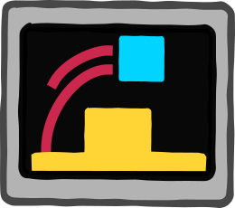
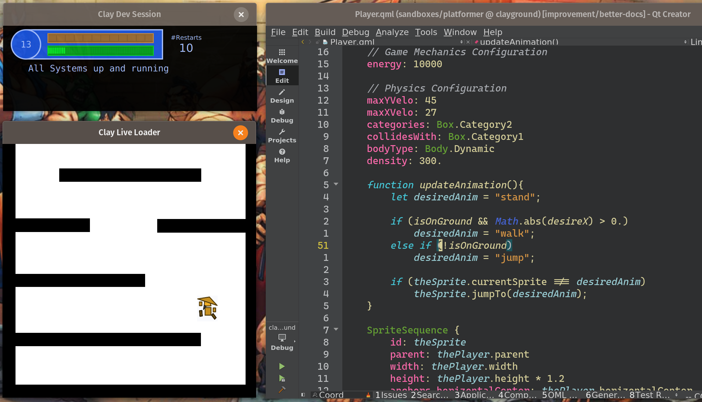
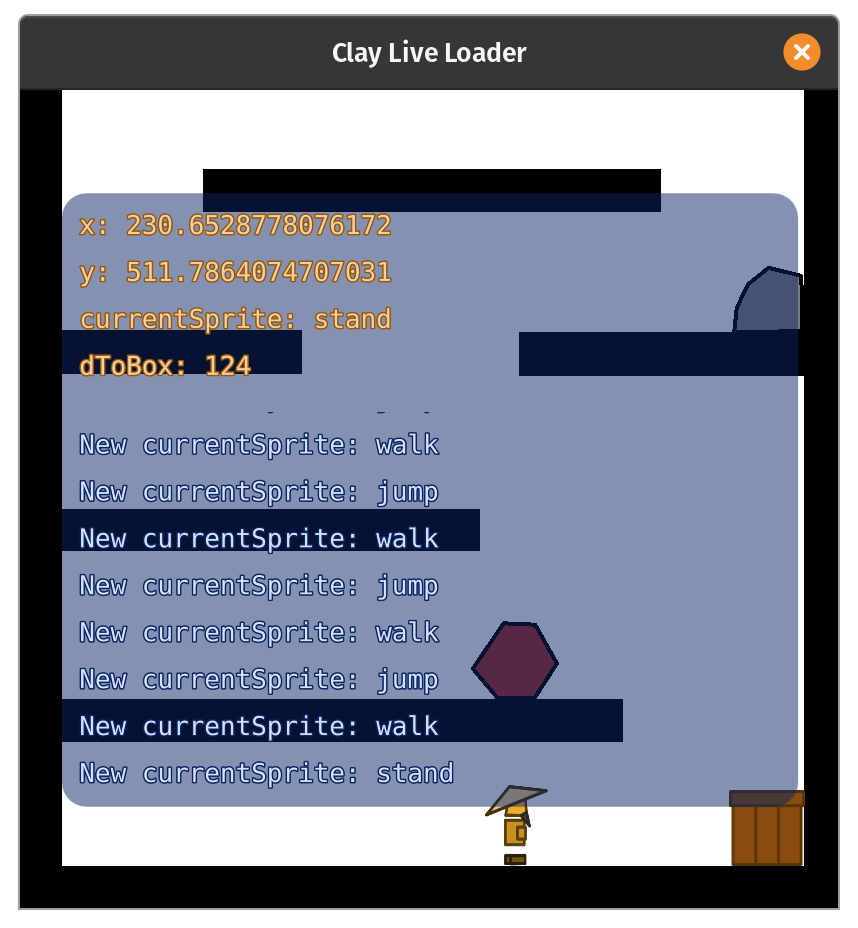

# Clayground: Flow, Form, Create



## Overview

When participating at [Ludum Dare 44](https://ldjam.com) I started to develop
utilities and a live loading app to ease game creation. As I really enjoyed
using these components, I decided to create a separate project and to make it
open source.

Clayground is a [Qt](https://www.qt.io) based toolset that allows using C++, JavaScript
and [QML](https://doc.qt.io/qt-6/qtqml-index.html) to rapidly develop apps in a sandbox
environment with live loading capabilities.  It provides tools that try both, facilitating
learning and allowing more focused and faster development by reducing typical build and restart times significantly.

Before distributing a Clayground-based app, please read the LICENSE file for important information
about the Qt dependency and related licensing considerations.

📖 **[Documentation](https://mistergc.github.io/clayground/)** - Getting started guides, plugin docs, and more.



Goals/Basic Design Decisions:

- Target Scope: Optimize for (rapid) prototyping and small/medium app development
- Focus on written source code and keyboard actions not for usage of graphical tools
- Full control: Add dedicated APIs but allow bypassing them easily (full power of C++, Qt/Qml, JavaScript)
- Don't provide (graphical) tools: Go for approaches that allow usage of freely available, popular tools like Qt Creator, Git and Inkscape
- Qt as Foundation: Don't write everything from scratch, but think how to re-combine Qt's capabilities

## Architecture

Clayground follows a layered plugin architecture where each layer builds upon the previous:

```
┌─────────────────────────────────────────────────────────────────┐
│                        YOUR APPLICATION                         │
│                   (Examples: platformer, topdown)               │
├─────────────────────────────────────────────────────────────────┤
│                           DOJO                                  │
│              Live-reloading sandbox environment                 │
├─────────────────────────────────────────────────────────────────┤
│                       GAME SYSTEMS                              │
│  ┌─────────┐  ┌─────────┐  ┌──────────┐  ┌──────────────────┐  │
│  │  World  │  │ Physics │  │ Behavior │  │ GameController   │  │
│  │  2D/3D  │  │ Box2D   │  │ Movement │  │ Keyboard/Gamepad │  │
│  └─────────┘  └─────────┘  └──────────┘  └──────────────────┘  │
├─────────────────────────────────────────────────────────────────┤
│                        RENDERING                                │
│         ┌──────────────┐         ┌──────────────┐              │
│         │    Canvas    │         │   Canvas3D   │              │
│         │   2D world   │         │  3D/Voxels   │              │
│         └──────────────┘         └──────────────┘              │
├─────────────────────────────────────────────────────────────────┤
│                        FOUNDATION                               │
│  ┌────────┐  ┌─────────┐  ┌──────┐  ┌─────┐  ┌─────────────┐  │
│  │ Common │  │ Storage │  │ Text │  │ SVG │  │   Network   │  │
│  └────────┘  └─────────┘  └──────┘  └─────┘  └─────────────┘  │
├─────────────────────────────────────────────────────────────────┤
│                     Qt 6 / QML / C++17                          │
└─────────────────────────────────────────────────────────────────┘
```

**Key principles:**
- **Pick what you need**: Plugins are independent - use any subset for your project
- **QML-first**: Write game logic in QML/JavaScript, drop to C++ only when needed
- **Live reload**: Edit code while running - changes apply instantly via Dojo
- **Leverage Qt**: Don't reinvent - combine Qt's capabilities in game-friendly ways

Main components:

- **Dojo**: Sandbox environment which is designed to be used for rapid dev, it is typically put next to a code editor/IDE, code changes are automatically applied
- **Plugins**: Different packages that can be used to build (interactive) apps
- **Examples**: Demonstrate the usage of Clayground, all examples can be either used with Dojo or standalone

Certainly, let's make it more compact while retaining the essence:

### Plugins: Your Building Blocks in Clayground

Each plugin comes with comprehensive documentation. Click the links to learn more about each one.

**Foundation Plugins:**

- **[Common](plugins/clay_common/README.md)**: Essential utilities and timing tools used across the framework
- **[Storage](plugins/clay_storage/README.md)**: Persistent key-value storage for game data and settings
- **[Text](plugins/clay_text/README.md)**: CSV parsing, JSON transformations, and text highlighting
- **[SVG](plugins/clay_svg/README.md)**: Read/write SVG files and use them as image sources for game assets

**Rendering Plugins:**

- **[Canvas](plugins/clay_canvas/README.md)**: 2D world coordinate system with camera and viewport management
- **[Canvas3D](plugins/clay_canvas3d/README.md)**: 3D primitives including boxes, lines, and voxel maps with toon shading

**Game System Plugins:**

- **[Physics](plugins/clay_physics/README.md)**: Box2D-based 2D physics with world unit integration
- **[World](plugins/clay_world/README.md)**: Complete game world management for both 2D and 3D games
- **[Behavior](plugins/clay_behavior/README.md)**: Reusable entity behaviors like movement, path following, and triggers

**Input/Output Plugins:**

- **[GameController](plugins/clay_gamecontroller/README.md)**: Unified input system supporting keyboard, gamepad, and touch
- **[Network](plugins/clay_network/README.md)**: Peer-to-peer networking and HTTP client for multiplayer and web APIs

### Examples: See how problems can be solved with Clayground

A bunch of example application allow you to try it out easily:

- GUI: Visual training app for keyboard shortcuts, comes with a configuration for Inkscape.
- VisualFX: Implementation of different visual effects, includes usage of the [Qt Particle System](https://doc.qt.io/qt-6/qtquick-effects-particles.html).
- Platformer: Starting point for a platformer game.
- TopDown: Starting point for a topdown game (for example a classical RPG), comes with network support
- PluginLive: Demonstrates how to use the Clayground LiveLoader to develop a C++ plugin

### How to work with a sandbox?

1. Clone this repo and build it using CMake (Qt 6.10.0+). Make sure to pull the submodules `git submodule update --recursive --init`
2. Start the dojo app `claydojo --sbx <clone-dir>/sandboxes/void/Sandbox.qml`
3. Move the created windows to a location that allows you to keep them visible even when your are editing code.
4. Make changes to `<clone-dir>/sandboxes/void/Sandbox.qml` -> see the changes applied automatically
5. Press `Ctrl+G` in the app window to show the Guide/Help overlay.
6. Check out the other sandboxes in the same way :)

### How to work with multiple sandboxes?

If you pass multiple `--sbx` args (up to 5) to the dojo app, you can switch between them by using `Ctrl+(1|2|3|4|5)`.
Alternatively, you can just edit one sandbox file and the dojo app will change to the sandbox automatically if needed.
This allows you for example to work on a complete app using one `sbx` and quickly doing isolated experiments with a
minimal `sbx` like `examples/void/Sandbox.qml`.

#### Using the Logging Overlay

The sandbox comes with a logging overlay that shows all `console.log(...)` messages in a continous log view and watched properties/expressions in a sticky section. You can
easily show/hide the logging overlay by pressing `Ctrl+L` when the Sandbox Window has the focus.



Have a look at the `onMapLoaded` signal handler of the Platformer Sandbox to see how you can use them.

### How to create a deployable app?

Each of the demo sandboxes also comes with a CMake application configuration which
allows to build a standalone app. So you can just use one as a template to build your own app.

### Is there any recommended development setup?

- OS: Linux (fastest and easy to use) - I have also used it on macOS and Windows 10, still good but use Linux if you can
- IDE/Editor: Qt Creator as it also allows you to easily debug and profile resulting apps - additionally I use Vim and VS Code for various text processing tasks

### What platforms are supported for deployment?

- **Desktop**: Linux, macOS, Windows
- **Mobile**: iOS, Android
- **Web**: WebAssembly (Emscripten) - see [Getting Started](https://mistergc.github.io/clayground/getting-started/#building-for-webassembly) for build instructions

### Testing

Clayground uses a layered testing approach:

```
              ┌───────────────────────┐
             ╱  Integration Tests     ╲   Examples run as smoke tests
            ╱   (all examples in CI)   ╲  ensuring basic functionality
           ├───────────────────────────┤
          ╱     Plugin Tests            ╲  Each plugin's Sandbox.qml
         ╱      (Sandbox validation)     ╲ validates its components
        ├─────────────────────────────────┤
       ╱         Unit Tests               ╲  QML TestCase for
      ╱          (per component)           ╲ individual components
     └─────────────────────────────────────┘
```

**Running tests:**
```bash
cmake -B build && cmake --build build
ctest --test-dir build --output-on-failure
```

**Test infrastructure:**
- `clay_app()` automatically registers apps as integration tests
- `clay_add_qml_test()` macro for QML unit tests using Qt's qmltestrunner
- Tests run headless (`QT_QPA_PLATFORM=minimal`) in CI on Linux and Windows

**Adding plugin tests:**
```cmake
clay_add_qml_test(MyPlugin
    DIRECTORY ${CMAKE_CURRENT_SOURCE_DIR}/tests
)
```

### Plugin Development

ClayDojo and ClayLiveLoader support dynamic plugin development using the `--dynplugin` command-line argument. This feature allows you to specify source and binary directories for plugins, enabling hot-reloading during development.

#### Using the `--dynplugin` argument

The `--dynplugin` argument takes two directory paths separated by a comma:

```
--dynplugin <source_dir>,<binary_dir>
```

- `<source_dir>`: The directory containing the plugin source code
- `<binary_dir>`: The directory where the compiled plugin binary will be placed

You can specify multiple `--dynplugin` arguments for different plugins.

#### Example usage

```bash
./claydojo --dynplugin /path/to/plugin/src,/path/to/plugin/build/bin
```

When using this feature:

1. The tools will monitor both the source and binary directories for changes.
2. When changes are detected in the source directory, the tool will wait for the binary directory to be updated (assuming you have a build process in place).
3. Once the binary is updated, the tool will automatically reload the plugin by restarting the LiveLoader.

Feel free to contact me, create issues or to contribute :)

Enjoy life,<br>
`mgc`
