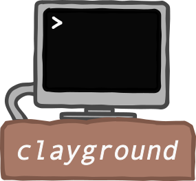

## Overview: Flow, Form, Create 
When participating at [Ludum Dare 44](https://ldjam.com) I started to develop
utilities and a live loading app to ease game creation. As I really enjoyed
using these components, I decided to create a separate project and to make it
open source.

Clayground is a [Qt](https://www.qt.io) based toolset that allows using C++, JavaScript
and [QML](https://doc.qt.io/qt-6/qtqml-index.html) to rapidly develop apps in a sandbox
environment with live loading capabilities.  It provides tools that try both, facilitating
learning and allowing more focused and faster development by reducing typical build and restart times significantly.

Goals/Basic Design Decisions:
- Target Scope: Optimize for (rapid) prototyping and small/medium app development
- Focus on written source code and keyboard actions not for usage of graphical tools
- Full control: Add dedicated APIs but allow bypassing them easily (full power of C++, Qt/Qml, JavaScript)
- Don't provide (graphical) tools: Go for approaches that allow usage of freely available, popular tools like Qt Creator, Git and Inkscape
- Qt as Foundation: Don't write everything from scratch, but think how to re-combine Qt's capabilities 

Main components:
- **Dojo**: Sandbox environment which is designed to be used for rapid dev, it is typically put next to a code editor/IDE, code changes are automatically applied 
- **Plugins**: Different packages that can be used to build (interactive) apps
- **Examples**: Demonstrate the usage of Clayground, all examples can be either used with Dojo or standalone

### Plugins: Clayground's basic building blocks
Clayground comes with a set of plugins that extend Qt capabilities in order to
build interactive experiences:
- Physics: Adds 2D Physics capabilities based on Box2D
- Canvas: A canvas component that provides a 2D virtual/world coordinate
  system, tries to hide dealing with pixels as much as possible.
- SVG Utils: Allows inspection of (Inkscape based) SVGs, can be used to create 2d scenes
- GameController: Supports game input using two different sources Keyboard and Touch Screen with single component (unfortunately Qt6 doesn't support Qt Gamepad yet(?))
- Storage: Get persistent storage with a very simple API
- World: Uses Canvas, Physics and SVG to provide a foundation for small games and simulations
- Network: Simple networking with automatic detection of other nodes and high-level peer to peer messaging

### Examples: See how problems can be solved with Clayground
A bunch of example application allow you to try it out easily:
- GUI: Visual training app for keyboard shortcuts, comes with a configuration for Inkscape.
- VisualFX: Implementation of different visual effects, includes usage of the [Qt Particle System](https://doc.qt.io/qt-6/qtquick-effects-particles.html).
- Platformer: Starting point for a platformer game.
- TopDown: Starting point for a topdown game (for example a classical RPG), comes with network support 
- PluginLive: Demonstrates how to use the Clayground LiveLoader to develop a C++ plugin

### How to work with a sandbox?
1. Clone this repo and build it using CMake (Qt 6.2.4+, Qt Creator 7.0.0+). Make sure to pull the submodules `git submodule update --recursive --init`
2. Start the dojo app `claydojo --sbx <clone-dir>/sandboxes/void/Sandbox.qml`
3. Move the created windows to a location that allows you to keep them visible even when your are editing code.
4. Make changes to `<clone-dir>/sandboxes/void/Sandbox.qml` -> see the changes applied automatically
5. Press `Ctrl+G` in the app window to show the Guide/Help overlay.
6. Check out the other sandboxes in the same way :)

### How to work with multiple sandboxes?
If you pass multiple `--sbx` args (up to 5) to the dojo app, you can switch between them by using `Ctrl+(1|2|3|4|5)`.
Alternatively, you can just edit one sandbox file and the dojo app will change to the sandbox automatically if needed.
This allows you for example to work on a complete app using one `sbx` and quickly doing isolated experiments with a
minimal `sbx` like `examples/void/Sandbox.qml`.

#### Using the Logging Overlay
The sandbox comes with a logging overlay that shows all `console.log(...)` messages in a continous log view and watched properties/expressions in a sticky section. You can 
easily show/hide the logging overlay by pressing `Ctrl+L` when the Sandbox Window has the focus.

Have a look at the `onMapLoaded` signal handler of the Platformer Sandbox to see how you can use them.

### How to create a deployable app?
Each of the demo sandboxes also comes with a CMake application configuration which 
allows to build a standalone app. So you can just use one as a template to build your own app.

### Is there any recommended development setup?
- OS: Linux (fastest and easy to use) - I have also used it on macOS and Windows 10, still good but use Linux if you can 
- IDE/Editor: Qt Creator as it also allows you to easily debug and profile resulting apps - additionally I use Vim and VS Code for various text processing tasks

Feel free to contact me, create issues or to contribute :)

Enjoy life, 
`mgc`
