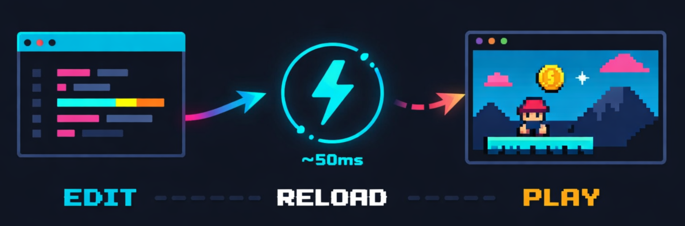

  <h1 class="pixel-title">Clayground</h1>
  
Flow, Form, Create

A [Qt](https://www.qt.io)-based sandbox for building 2D and 3D games with [QML](https://doc.qt.io/qt-6/qtqml-index.html). Edit your code, save the file, see the result — no restart needed. Clayground provides the tools, components, and live-reloading workflow to go from idea to playable prototype fast.

  <a href="{{ site.baseurl }}/docs/getting-started/" class="btn btn-primary">Get Started</a>
  <a href="{{ site.baseurl }}/webdojo/" class="btn btn-secondary">Try Web Dojo →</a>

## How It Works

*Edit QML in your editor, save the file, see the result — tweak colors, physics, or layout and watch the game update within milliseconds, without ever leaving your flow.*

  

    
1

    

      <h4>Write QML</h4>
      
Build your game logic, visuals, and physics using QML and JavaScript. Pull in only the plugins you need — from 2D canvas to 3D voxels, physics, input, and networking.

    

  

  

    
2

    

      <h4>Dojo Watches</h4>
      
The Dojo sandbox monitors your source files. When you save a change, it reloads automatically — no compile step, no manual restart. Use the logging overlay (<code>Ctrl+L</code>) to inspect values live.

    

  

  

    
3

    

      <h4>Ship Everywhere</h4>
      
Deploy to Linux, macOS, Windows, iOS, or the web via WebAssembly. The same QML code runs on all platforms. Try it right now with the <a href="{{ site.baseurl }}/webdojo/">Web Dojo</a>.

    

  

## Why Clayground?

- **Live Reloading with Dojo** — Clayground's development tool watches your QML files and reloads them on every save. You stay in your editor, tweak a property, and see the result immediately in the running app. No build-run-test cycles for gameplay iteration.

- **Modular Plugin System** — Pick the plugins you need: 2D canvas with world coordinates, Box2D physics, 3D voxel rendering, SVG-based level design, unified input handling, P2P networking, or on-device AI. Each plugin is self-contained and they compose cleanly.

- **Code-First, Full Control** — No visual editor, no black boxes. Your game is QML and JavaScript with optional C++ when you need raw performance. You always have direct access to Qt's full API underneath.

- **Desktop to Browser** — Build and test natively, then compile to WebAssembly and share a playable link. The Web Dojo lets others try your sandboxes without installing anything.

[Explore all features →]({{ site.baseurl }}/features/)
