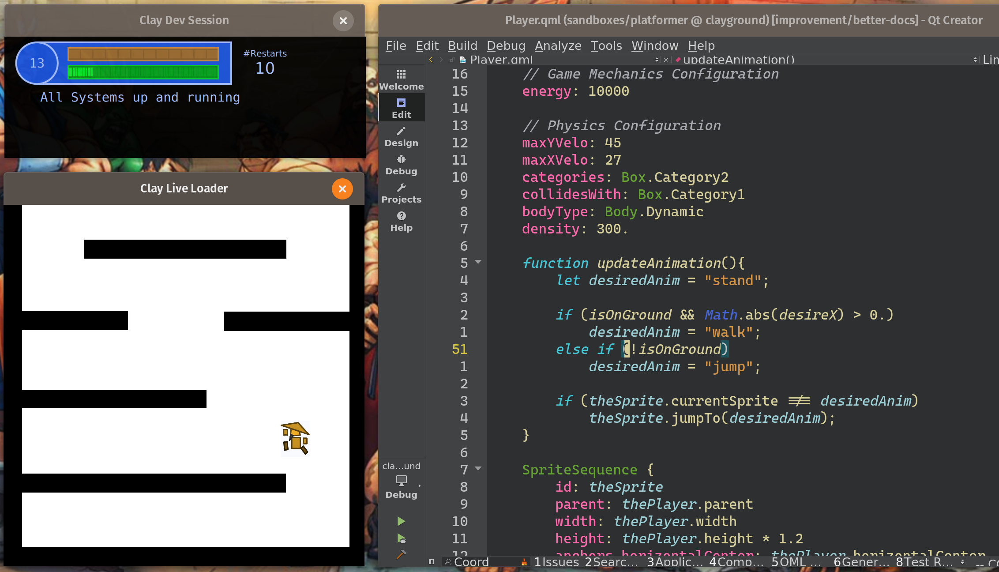

## Rapid Game Development with Live-Reloading

Clayground is a [Qt](https://www.qt.io)-based toolset that combines C++, JavaScript, and [QML](https://doc.qt.io/qt-6/qtqml-index.html) for rapid game development in a sandbox environment with live-reloading capabilities. Born from game jam experiences, it's designed to reduce build times and accelerate the creative process.



## Why Clayground?

- **Instant Feedback**: See code changes applied immediately without restarting
- **Modular Design**: Mix and match plugins to build your game
- **Full Control**: Use high-level APIs or dive into C++/Qt when needed
- **Cross-Platform**: Deploy to desktop, mobile, and potentially web

## Core Components

### 🎮 Dojo
The live-reloading sandbox environment. Edit your code, save, and watch changes appear instantly.

### 🧩 Plugins
Modular building blocks for games:
- **2D/3D Rendering** - Canvas systems with world coordinates
- **Physics** - Box2D integration with world units
- **Input** - Unified controller system for keyboard, gamepad, and touch
- **Networking** - P2P multiplayer and HTTP APIs
- **And more!**

[Explore all plugins →]({{ site.baseurl }}/plugins/)

### 📚 Examples
Ready-to-run demos showcasing different game types and techniques.

## Quick Start

```bash
# Clone and build
git clone --recursive https://github.com/yourusername/clayground.git
cd clayground
cmake -B build && cmake --build build

# Run the sandbox
./build/bin/claydojo --sbx examples/void/Sandbox.qml
```

Press `Ctrl+G` in the app window to see available shortcuts!

[Get Started →]({{ site.baseurl }}/getting-started/)

## Design Philosophy

- **Rapid Prototyping First**: Optimize for quick iteration and experimentation
- **Code-Centric**: Focus on writing code, not clicking through tools
- **Leverage Qt**: Build on Qt's powerful foundation instead of reinventing
- **Open and Extensible**: Easy to understand, modify, and extend

## Who Is This For?

- **Game Jammers**: Rapid prototyping with instant feedback
- **Indie Developers**: Build small to medium games efficiently  
- **Learners**: Explore game development with immediate results
- **Qt Developers**: Use familiar tools for game creation

---

<div class="cta-buttons">
  <a href="{{ site.baseurl }}/getting-started/" class="btn btn-primary">Get Started</a>
  <a href="{{ site.baseurl }}/plugins/" class="btn btn-secondary">Browse Plugins</a>
  <a href="https://github.com/mistergc/clayground" class="btn btn-outline">View on GitHub</a>
</div>