# Character 101 — one procedural character, one aspect at a time

*Companion paper to the interactive lab in `labs/character-101/`. Overview
board: `overview.grafli`. Kit model card: `labs/kits/character/README.md`.
Purpose: **teaching** — this is a lesson plan, the guided flow
(`character-tour`) is the primary artifact, and this paper is its script.
Started 2026-09-11. Annotate freely with CriticMarkup.*

## The question

A cartoon character in Clayground is not modelled and not keyframed: its body
is a handful of sliders and everything it does — walk, gesture, box, kick,
smile, talk, listen — is computed from a small model at run time. **What does
such a character consist of, and how do you check any part of it?**

The lab exists so that every aspect has one place to be looked at *and*
measured. Each scenario is one aspect; each aspect says what it is for on its
card and answers a `report()` an agent can read headless. The claim under
the whole lab is that a procedural animation written once fits every body
the sliders can make.

## The misconception it targets

*"A character is a mesh with animations attached. To get a different
character you model it again; to get a different walk you animate it again;
checking one means watching it."*

Arriving with that belief, a learner expects six different bodies to need six
walks, expects a gesture to be judged in motion, and expects render cost to
follow polygon count. The lab is built so that the number says otherwise in
each case.

## The demonstration sequence

| Beat | Scenario / action | Ask them | Flow step |
|---|---|---|---|
| 1 | `lineup` — six builds walking one cycle | do they walk at the same tempo? | `lineup` |
| 2 | `gait`, preset *elderly*, from the side | which four frames matter on a walk sheet? | `gait` |
| 3 | the same sheet from above | what can you only see from here? | `gaitTop` |
| 4 | *they* switch the cycle to a run | (they act) | `try` |
| 5 | the run's cycle length appears on the card | why did one number change everything? | `run` |
| 6 | `gestures` — thirteen frozen columns | can you name each from the silhouette? | `gestures`, `silhouette` |
| 7 | `action` — the boxing loop running from the clock | pause it: is this a guard? | `action` |
| 8 | `moves` — a loaded set of fourteen | does the lowest foot stay on the floor? | `moves` |
| 9 | `hands` — the articulated hand close up | how many pixels is a hand? | `hands` |
| 10 | `faces` — six expressions on one head | how far apart is the closest pair? | `faces` |
| 11 | `heads` — three detail tiers, talking | at which size does a tier swap show? | `heads` |
| 12 | `speech` — one recording, three tiers | what can the envelope not hear? | `speech` |
| 13 | `conversation` — a speaker and a listener | what is a listener made of? | `conversation` |
| 14 | `crowd` — twenty characters | what does a character cost? | `crowd` |

Then, outside the flow, every card offers its own choices and knobs; the
plot and the record follow whichever scene is up.

## The moment the number contradicts the belief

Beat 1, and it is on the card before anyone presses a key. Six bodies walk
the same cycle and the card lists six cycle lengths: the child's is
**0.656 s**, the heavy eater's **0.935 s**, the athletic hero's **0.760 s**
(`records/lineup-42.labrec`). Nobody animated a child's walk; the gait model
derived tempo and stride from the build. Beat 5 makes the same point with one
figure: the elderly preset walks a **1.111 s** cycle and runs a **0.625 s**
one — a base cycle divided by a tempo factor of 0.72 — and the flow asserts
both numbers.

Beat 14 closes it: twenty characters at Low detail are 440 boxes, and the
cost of drawing them is a count of boxes, not of vertices.

## The takeaway

*A character is a model, not a file: change the body and every animation
follows; change the model and every character does.*

## When they ask…

- **If the walk is derived, what is a preset?** A factor vector — tempo,
  stride, lean, arm swing and ten more, each multiplied onto or added to the
  base cycle. The elderly preset is `tempo 0.72, stride 0.6, lean 8,
  spineCurve 18, headPitch 15, armSwing 0.45, elbow 18, kneeLift 0.45`
  (the card's *factors off neutral* row), and the sheet is the same
  function the running walk plays, so what reads wrong on the sheet is
  wrong at speed.
- **Why freeze a gesture instead of watching it?** Because a set is judged
  against its neighbours and a single pose is judged against a memory, and
  memory grades generously. The thirteen columns stand still so the eye can
  compare; the two action cycles are judged *running* in the next scenario
  for the opposite reason — a punch that floats and one that snaps freeze to
  the same picture.
- **Why do the speech and conversation records read zero?** Their motion
  belongs to the plugin's own animators and to a recording playing on the
  wall clock; a stepped run, which is what a record is, honestly sees nothing
  moving. Those scenes are for looking and for `report()`, and the lab says
  so on their cards.
- **Are the crowd's milliseconds mine?** No — they are this machine's, and
  the record made offscreen holds zeros because nothing rendered. What
  carries is the shape: draws per character (42.8 on the lab's stage, which
  adds a shadow pass; 22 boxes on the bare bench) and vertices that barely
  move the needle.

## Measured results

*Quote only what a record holds.* Every number below comes out of a committed
run record; regenerate them all with

```sh
labs/character-101/records/make.sh
```

and prove them stable with `records/make.sh --verify` (two runs, byte
compared — eleven scenarios, all deterministic). Each record is the scene in
the state it cold-opens into, seed 42, 600 steps of 1/60 s.

| Scenario | Quantity | Value | Record |
|---|---|---|---|
| `lineup` | cycle length, child / hero / player / stylized / thinker / eater | 0.656 / 0.760 / 0.792 / 0.786 / 0.772 / 0.935 s | `records/lineup-42.labrec` |
| `lineup` | hip swing of the hero over a cycle | −25.7° … +20.5° | `records/lineup-42.labrec` |
| `gait` | cycle length, speed, stride (neutral walk, default build) | 0.800 s, 10.38 u/s, 8.30 u | `records/gait-42.labrec` |
| `gait` | hip, knee, arm over the cycle | −25 … 20°, 15 … 45°, −15 … 13.5° | `records/gait-42.labrec` |
| `gestures` | columns; guard elbow; work elbow; work lean | 13; −138°; −92.4°; 8.4° | `records/gestures-42.labrec` |
| `action` | boxing cycle at intensity 0.5; elbow over the cycle | 1.70 s; −152 … −14° | `records/action-42.labrec` |
| `moves` | moves; lowest foot; highest foot (set sheet, stance phase) | 14; −0.039 … −0.019 leg heights; 0.087 … 0.089 | `records/moves-42.labrec` |
| `hands` | palm width over arm width, bench build | 1.101 | `records/hands-42.labrec` |
| `faces` | closest pair of the six, in uniform space | 1.206 | `records/faces-42.labrec` |
| `heads` | (no probe — the head's pixel height depends on the camera and lives in `report()`) | — | `records/heads-42.labrec` |
| `speech`, `conversation`, `crowd` | mouth, gaze/nod/brow, draws/verts/frame | all 0 in a stepped run, by design | their records |

The tour carries the key numbers as `expect`s — the elderly walk's 1.111 s
and run's 0.625 s, the thirteen columns and a folded guard elbow, the 1.70 s
boxing round, fourteen moves with no foot below −0.05 leg heights, the 1.10
palm, the 1.206 closest pair, twenty characters at 440 boxes — so a model
that drifts breaks its own lesson before it teaches a wrong number.

The lowest foot of the stance reads −0.019 leg heights rather than 0: the
kit's foot-height helper folds thigh and shin and ignores the ankle joint, so
"on the floor" lands a toe below it. The tour's bound is −0.05 for that
reason, and the number is the helper's, not the set's.

Twelve figures, regenerated by `figures/make.sh`, one per aspect in the
tour's order; nothing above is read off them.

| | |
|---|---|
| 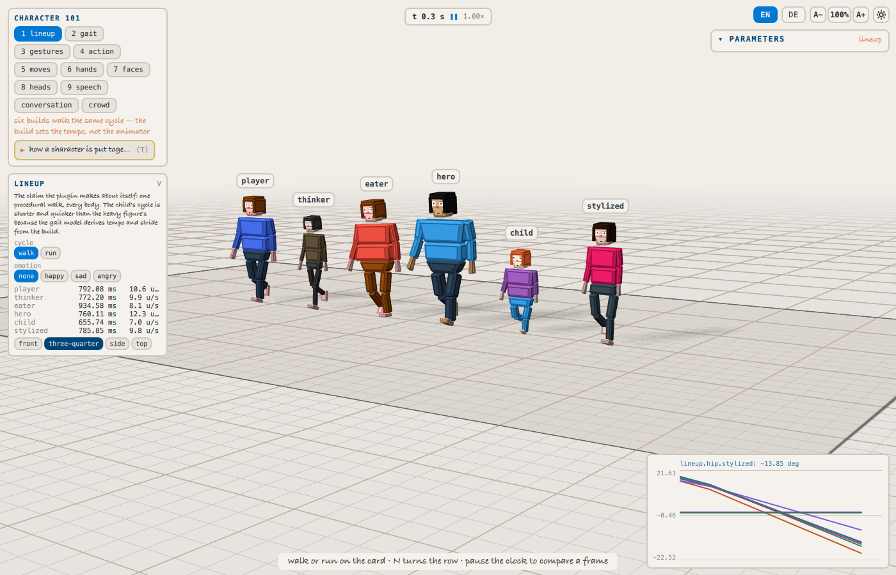 | 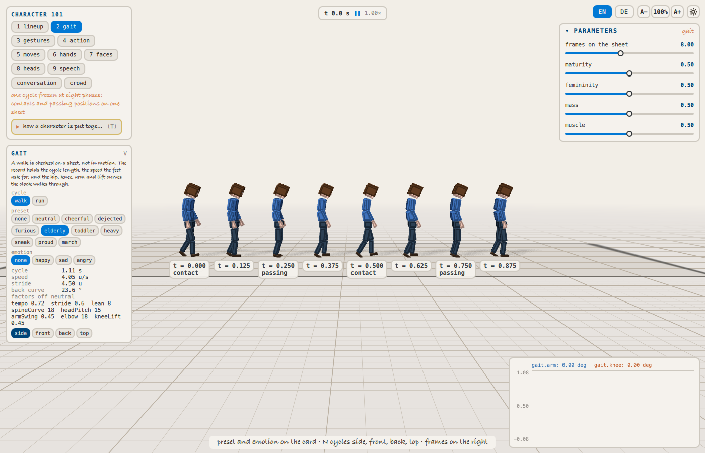 |
| `lineup` — six builds, one walk, six tempos | `gait` — the elderly preset at eight phases |
| 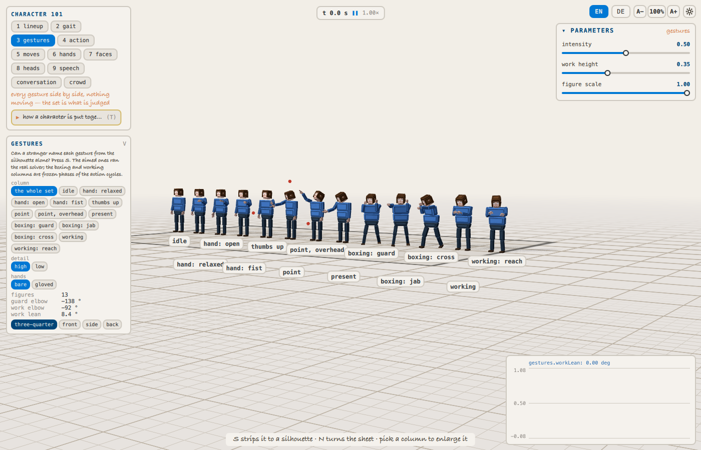 | 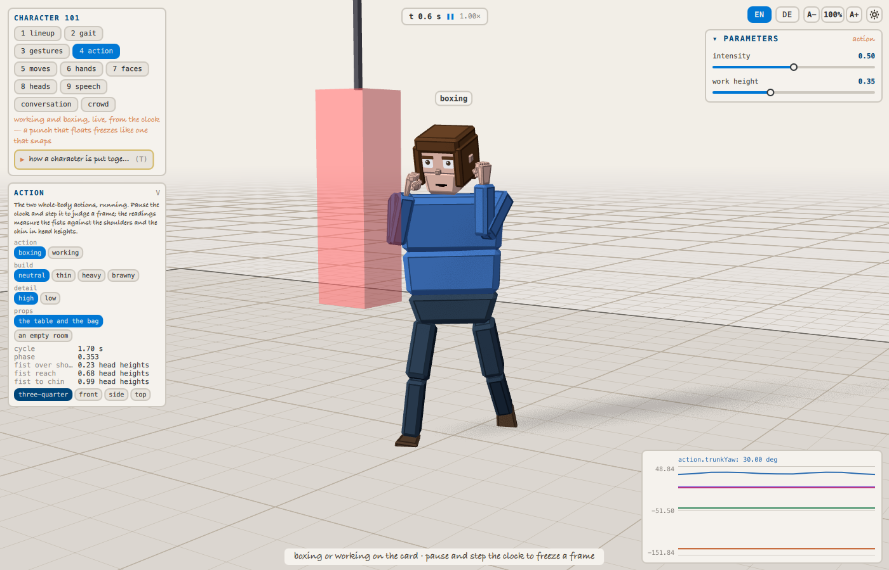 |
| `gestures` — the set, frozen | `action` — the boxing loop, running |
| 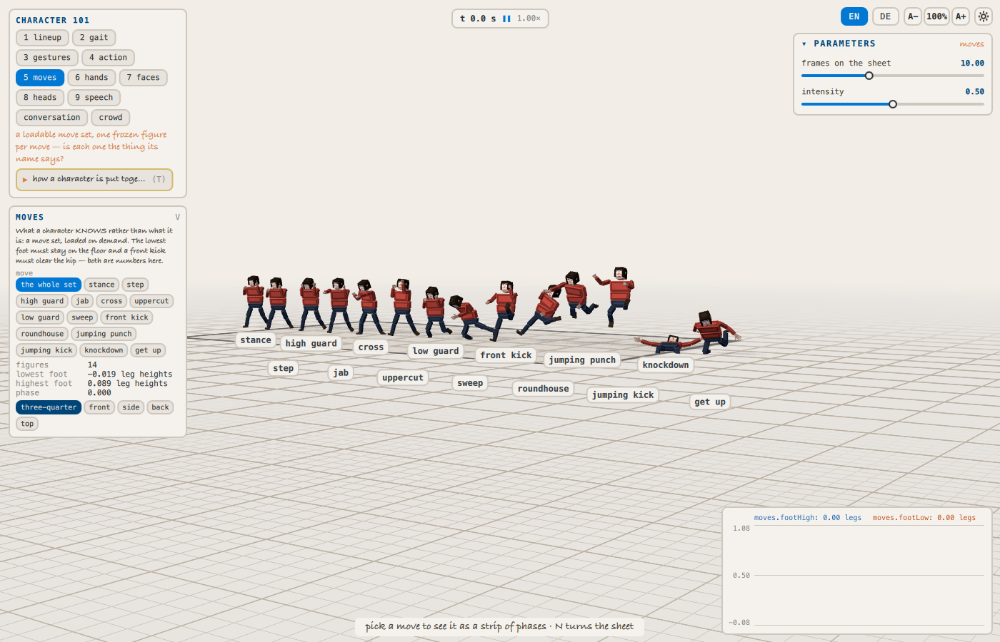 | 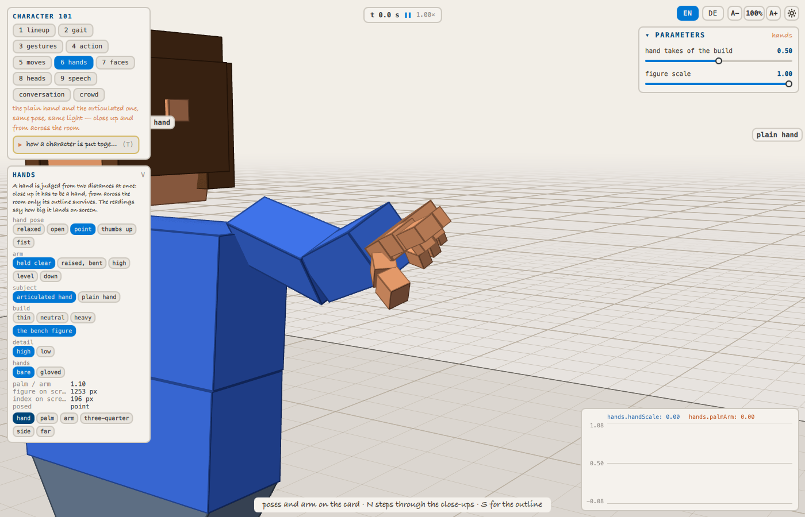 |
| `moves` — fourteen moves of the loaded set | `hands` — the articulated hand, pointing |
| 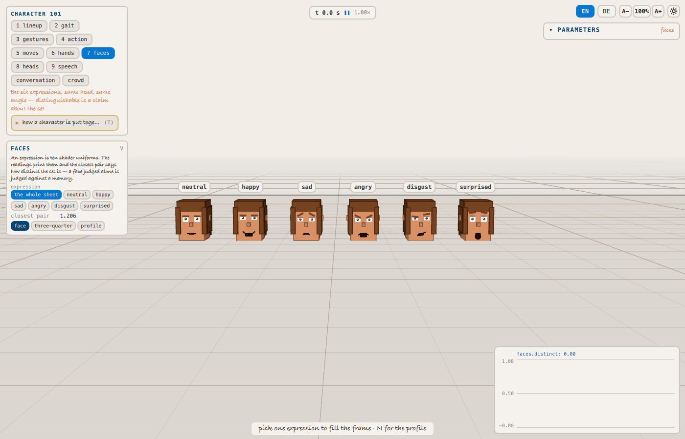 | 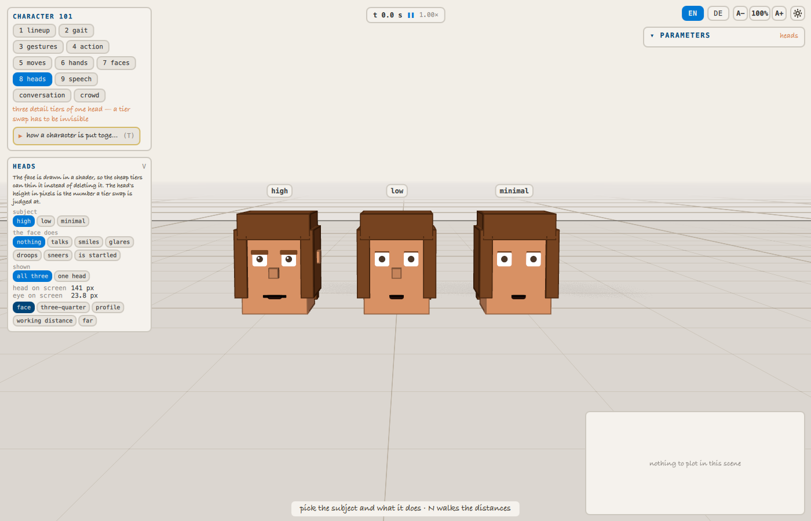 |
| `faces` — six expressions on one head | `heads` — three tiers of one head |
| 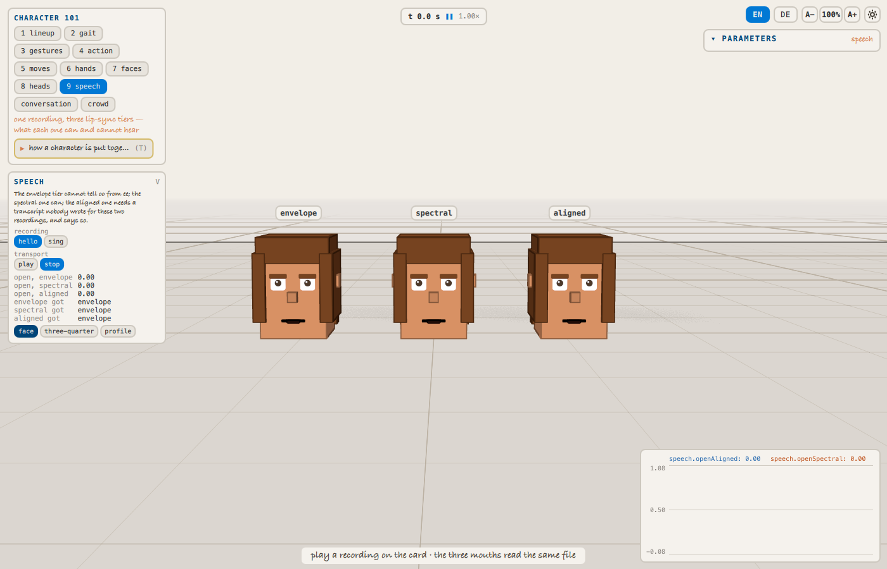 | 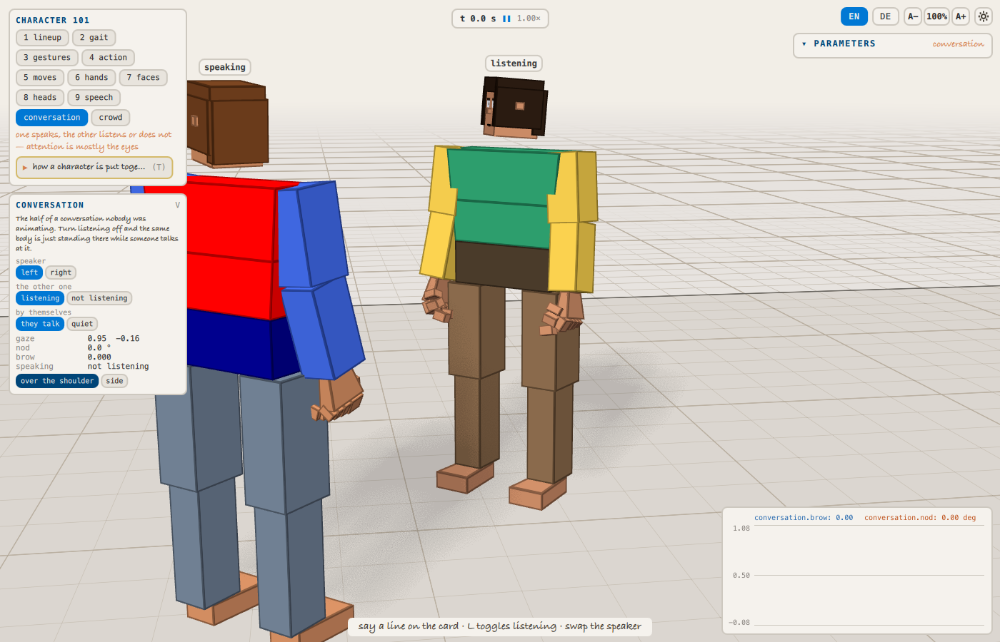 |
| `speech` — one recording, three tiers | `conversation` — over the speaker's shoulder |
| 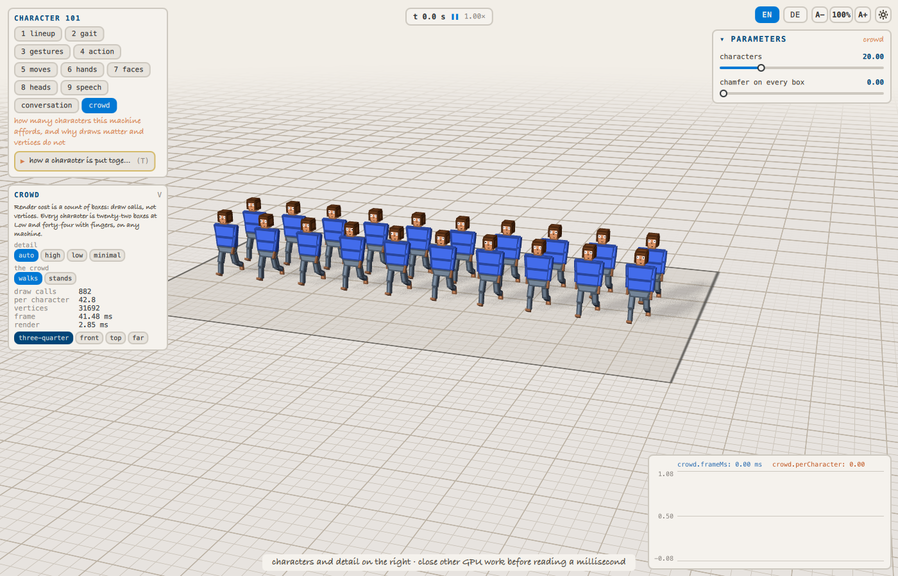 | 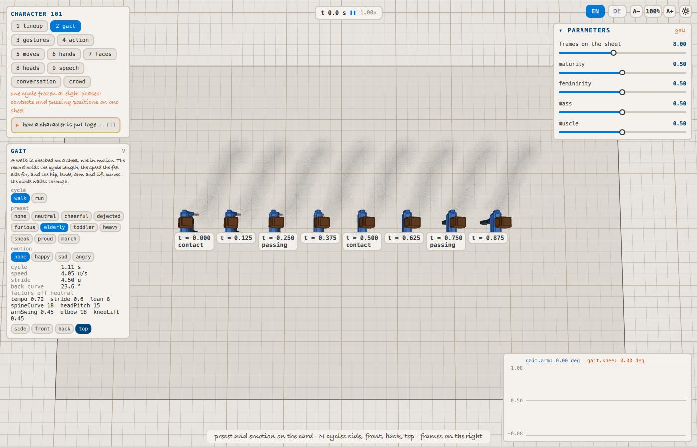 |
| `crowd` — twenty characters | `gait` from above — sway and rock |

## Stated simplifications

Labs teach concepts, and a simplified model is a feature provided every
simplification is declared. The kit's model card
(`labs/kits/character/README.md`) lists them; the ones a learner meets in
the lab:

- **A sheet reads the pose model, not the joints.** The gait, gesture, move
  and face probes come from the pure functions the animations play
  (`gaitPoseAt`, `actionPoseAt`, `movePoseAt`, `expressionTargets`), so a
  record is exact and cold. What a figure *wears* after its animators have
  settled is in `report()` and on screen, never in a record.
- **Scenes that belong to wall-clock animators record nothing moving.**
  Speech, conversation and crowd cold-open silent and still; their records
  are honest zeros.
- **The crowd's cost is measured on the lab's stage**, whose key light casts
  shadows and adds a pass: 42.8 draws per character where the bare bench
  measured 22 boxes. The number that carries is the ratio, not the count.
- **Foot height ignores the ankle.** See the note under the table.
- **The hand's slider tuner was not carried over** from the old bench; a
  pose row is edited in `DetailedHand.qml` and the scene re-rendered.

## How to run it

```sh
./build/bin/claydojo --sbx labs/character-101/Sandbox.qml      # QT_DISABLE_SHADER_DISK_CACHE=1
./build/bin/clayrender labs/character-101/Sandbox.qml --out /tmp/x.png --paused \
    --eval 'applyScenario("gait"); act("preset", ["elderly"])' \
    --wait-for 'sceneReady' --result - --eval 'JSON.stringify(scene.report())'
tools/lab-check/lab-check labs/character-101
```

Keys: `1`–`9` the first nine scenarios (the palette chips reach all eleven)
· `T` start / stop the tour · `Space` / `→` next, `←` back, `Esc` leave · `V`
the aspect card · `M` the plot · `S` silhouette · `N` next shot · `F` frame
the scene · `0` / `Home` reset the view · arrows / `WASD` travel · `Shift` +
arrows turn · `+` / `-` zoom · `Space` held lends the left button to the
camera · `Shift+R` record · `Ctrl` `+` / `-` / `0` text size · `Tab` focus
mode · `?` every key.

## Source map

- `labs/character-101/Sandbox.qml` — the entry point: scenarios select a scene
  (`ScenarioSet`), the `Loader3D` swaps it, `act()` dispatches scene verbs,
  `frameAll()` fits the scene's box, the card renders `choices` /
  `readout()`, the `Flow` is the tour.
- `labs/kits/character/README.md` — the scene contract and the model card.
- `labs/kits/character/GaitSheet.qml` — the reference scene; the others
  beside it, one per aspect.
- `labs/kits/character/sheet.js` — phase names, row layout, the gesture
  columns, the six faces and their distance, the lineup builds, boxes per
  character; `sheet.test.js` checks it.
- `plugins/clay_character3d/animation/gait.js`, `action.js`,
  `movesets/martialarts.js` — the pose models the probes read.
