# Electronics 101 — a school kit that obeys Kirchhoff

*Companion paper to the interactive lab in `labs/electronics-101/`.
Overview board: `overview.grafli`. Study: `studies/series-vs-parallel/`.
Annotate freely with CriticMarkup — remarks feed the next lab iteration.*

*Every picture below is rendered from the running lab by `figures/make.sh`,
so re-running it is how you find out whether the paper still looks like the
lab. They are **illustrative only**: no number in this paper is read off a
picture — the numbers come from the probes and the run records, which is what
they are for.*

## The question

Every school electronics set makes the same promise: snap a battery, a
switch and a lamp together and the lamp lights. What the plastic parts
never show is *why* — why two bulbs in series glow dim while the same two
in parallel blaze, why a resistor tames an LED, why one careless wire
from plus to minus is a short. This lab puts the kit on a 3D pegboard and
runs a real circuit solver underneath it: you take parts out of the
palette, wire terminals by clicking two gold pads, flip the switch,
and every LED, bulb and meter answers with the number Kirchhoff's laws
demand. The board is a toy; the physics is not.

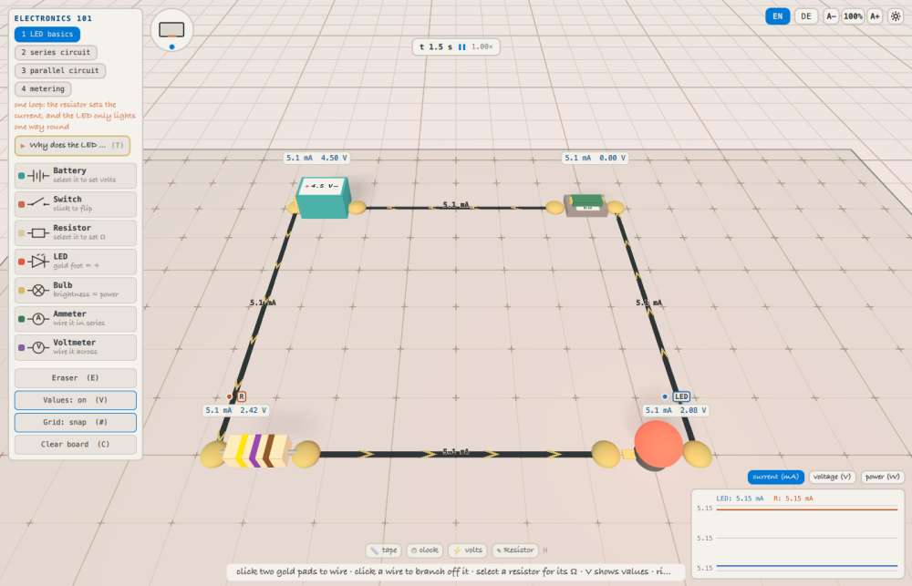

*The whole argument in one picture: a 4.5 V cell, a 470 Ω resistor and an LED
in one loop. The same 5.1 mA appears on every wire because there is only one
path, the resistor takes 2.42 V of the cell's 4.50 V and the LED the remaining
2.08 V, and the chevrons crawling along the wires point the way the current
actually runs. Nothing here is drawn by hand — every label is the solver's
answer.*

## The solver

The lab solves the board as a DC resistive network by **nodal analysis**
(`labs/kits/circuit/circuit.js`). Most parts have two terminals; the
transistor has three and the gate package has five. Wires merge terminals
into **nets** with union-find, so a net is one electrical node. With $n$
nets the unknowns are the node voltages
$\mathbf{v} = [v_0, \dots, v_{n-1}]^T$, and Kirchhoff's current law at
every node is one linear system:

$$
G\,\mathbf{v} = \mathbf{i}
$$

$G$ is the $n \times n$ conductance matrix, $\mathbf{i}$ the vector of
injected currents. Each element is a **Norton companion** — a conductance
$g$ in parallel with an optional current source — stamped between its two
nets $a$ and $b$ by the same four-entry pattern:

$$
G_{aa}\mathrel{+}= g,\quad G_{bb}\mathrel{+}= g,\quad
G_{ab}\mathrel{-}= g,\quad G_{ba}\mathrel{-}= g
$$

A plain resistor stamps $g = 1/R$ and no source. The **battery** is an
ideal source $V$ behind an internal resistance $R_\mathrm{int}=0.5\,\Omega$;
its Norton form is a conductance $1/R_\mathrm{int}$ plus a current source
$V/R_\mathrm{int}$ pushed into the $+$ terminal. A closed **switch** is
$0.01\,\Omega$, an open one $10^9\,\Omega$; the **ammeter** is a
$0.01\,\Omega$ shunt, the **voltmeter** a $10\,\mathrm{M}\Omega$ load; a
**bulb** is a fixed $6\,\Omega$ filament. A tiny leak conductance
($10^{-9}$) anchors every net to ground so that a disconnected island is
still a solvable system rather than a singular matrix. The assembled
$G\,\mathbf{v}=\mathbf{i}$ is solved by Gaussian elimination with partial
pivoting.

The **LED** is the one nonlinear part, modeled piecewise-linear rather
than by the full Shockley exponential:

$$
I_\mathrm{LED} =
\begin{cases}
0 & V \le V_F \\[2pt]
\dfrac{V - V_F}{R_\mathrm{LED}} & V > V_F
\end{cases}
\qquad V_F = 2.0\,\mathrm{V},\ R_\mathrm{LED} = 15\,\Omega
$$

Below the forward voltage the diode is an open circuit; above it, it
conducts along a straight line of slope $1/R_\mathrm{LED}$. In the
conducting branch that line is itself a Norton companion — conductance
$1/R_\mathrm{LED}$ with a current source $V_F/R_\mathrm{LED}$ into the
anode — so it stamps like everything else. Because whether an LED
conducts depends on the very voltages the solve produces, the solver
iterates: assume each LED's state, build and solve $G\,\mathbf{v}=\mathbf{i}$,
re-check each LED, repeat until the states stop changing. An LED that sits
in a branch which cannot carry current (behind an open switch, where the
leak dividers fake a faint forward bias) would flip on/off forever; a
flip counter pins it where it stands after six oscillations — the
physically correct answer for a dead branch — inside a 40-iteration cap.
Across every preset the lab ships, the fixed point is reached in
**1 to 7 iterations**; the transistor gates below use the same loop and
the same counter.

That iteration *is* the lesson made mechanical: current does not flow
because a wire exists, it flows because the node voltages, solved all at
once, leave a forward drop across a part that will pass it.

The plain **diode** is the same model with a lower knee
($V_F = 0.7\,\mathrm{V}$, $R = 10\,\Omega$) and no light. It is in the kit
because "the LED is a diode that glows" is a sentence worth being able to
check, and because two of them make a logic gate with no transistor in it.

## The transistor

The transistor is the first part in the kit with **three** terminals, and
the first whose current is controlled by something other than the voltage
across it. Terminal 0 is the collector, 1 the base, 2 the emitter; wires
merge all three into nets exactly as before, so nothing about the net
building or the linear solve changes.

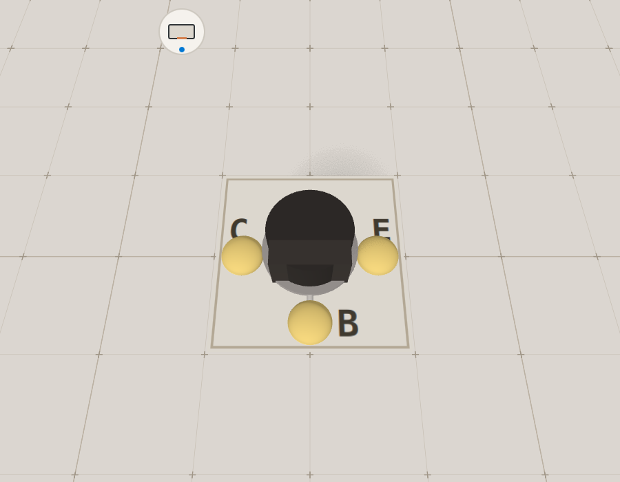

*The part, with the board saying which leg is which — the one thing about a
transistor that cannot be read off its shape. The flat face is on the base
side, and the grey collar at its foot is the region indicator: grey for cut
off, gold for active, green for saturated. Placed on a real board the part
is usually turned a quarter turn, and the print turns with it, the way
silkscreen does.*

What changes is the stamp. The base-emitter junction is the *same
piecewise-linear diode companion the LED uses*, with a 0.7 V knee — so the
base current is not a rule, it is whatever the network allows:

$$
I_B = \frac{V_{BE} - V_{F,BE}}{R_{BE}},\qquad
V_{F,BE} = 0.7\,\mathrm{V},\ R_{BE} = 25\,\Omega
$$

The collector is where a transistor stops being a diode. In the **active**
region it carries $\beta$ times the base current *regardless of the voltage
across it* — a current between the collector and emitter nets that depends
on the voltage between the **base** and emitter nets. That is the one
asymmetric stamp in this solver, and the reason $G$ is solved by plain
Gaussian elimination rather than by anything that assumes symmetry:

$$
G_{cb}\mathrel{+}= g_m,\quad G_{ce}\mathrel{-}= g_m,\quad
G_{eb}\mathrel{-}= g_m,\quad G_{ee}\mathrel{+}= g_m,
\qquad g_m = \beta / R_{BE},\ \beta = 100
$$

A current source cannot push current the supply has not got, so the model
carries three regions rather than one, and *which one it is in is solved
for*, on the same assume-solve-re-check loop the diodes use:

$$
\text{region} =
\begin{cases}
\textbf{off} & V_{BE} < V_{F,BE} \\[2pt]
\textbf{sat} & V_{BE} \ge V_{F,BE}\ \text{and}\ V_{CE} < V_{CE,\mathrm{sat}} \\[2pt]
\textbf{active} & \text{otherwise}
\end{cases}
\qquad V_{CE,\mathrm{sat}} = 0.15\,\mathrm{V}
$$

*Off* is two leakage resistors. *Active* is the transconductance above,
with a 100 kΩ collector-emitter leak standing in for the Early effect.
*Saturated* is the collector clamped at $V_{CE,\mathrm{sat}}$ behind a
4 Ω slope — a closed switch with a small offset, which is what a saturated
transistor is. Saturation is left again when the collector branch asks for
more than $\beta I_B$ can supply.

One number in there is not a physical constant but a **conditioning
decision**, and it was a bug first. Cut-off leakage is
$R_{BE,\mathrm{off}} = 10^{7}\,\Omega$ against an open switch's
$10^{9}\,\Omega$. With both at $10^9$ they form a 1:1 divider: a base
reached only through an open switch sits at half the supply, well past its
0.7 V knee, and **a transistor whose input is disconnected switches itself
on**. Real silicon leaks tens of nanoamps while a real open contact leaks
nothing measurable, so the two belong decades apart — here, two of them.
The kit's unit suite pins this case.

### Measured: one transistor as a switch

Preset `transistor` (`5`) is the smallest circuit that shows what the part
does: a switch and a 4.7 kΩ resistor into the base, an ammeter *in the base
lead*, and an LED with a 220 Ω resistor from the supply to the collector.

| switch | region | $I_B$ (meter) | $I_C$ | $V_{CE}$ | LED |
|---|---|---|---|---|---|
| open | `off` | 0.000 mA | 0.00 mA | 2.500 V | dark |
| closed | `sat` | 0.803 mA | 9.81 mA | 0.189 V | lit |

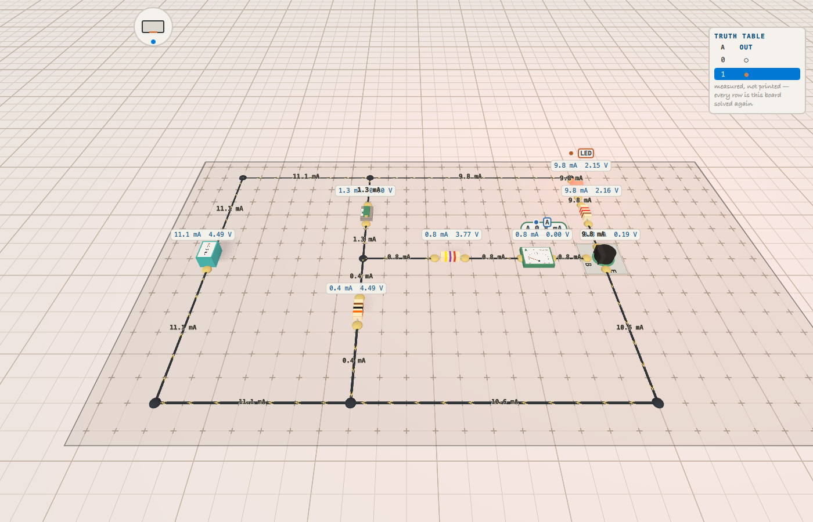

*The two currents in one frame, which is the only reason this preset is laid
out the way it is: the meter sits in the base lead and reads 0.80 mA, and the
lamp branch on the right carries 9.81.*

The base current is Ohm's law on the base branch and nothing else:
$(4.5 - 0.7)/(4700 + 25) = 0.804\,\mathrm{mA}$, which is what the meter
reads. The collector then carries **12.2 times** that — not a hundred
times, and the gap is the entire point. $\beta I_B$ would be 80 mA; the
lamp branch can only draw $(4.5 - 2.0 - 0.15)/(220 + 15) \approx
10\,\mathrm{mA}$, so the transistor runs out of circuit before it runs out
of gain and settles into saturation at $V_{CE} = 0.19\,\mathrm{V}$. **The
lamp, not the transistor, is setting the current** — which is exactly the
condition every logic gate below is operated in.

Starve the base instead (470 kΩ in the unit suite) and the same part sits
in the active region, where the ratio is $\beta$ to within the Early leak.
Same component, same equations, different circuit around it.

## Logic gates

The gates are the reason the transistor is in the kit, and none of them is
a part: each is a wiring, built from the same palette, with two switches
for inputs and one LED for the answer. Each input is a switch from the
supply to a node with a **10 kΩ pull-down** — not decoration, but the
difference between an input that is *low* and one that is merely *not
connected to anything*, which the paragraph above shows is not the same
thing.

The lab reads the answer back off the board rather than printing it. The
truth-table panel runs the solver once per input combination on a copy of
the exact board in front of you, so editing the circuit edits the table;
`labInfo().logic.table` returns the same thing to an agent.

### The cheapest gate has no transistor in it

Preset `diode-or` (`6`) is an OR made of two diodes: each input feeds the
lamp through one, and the diodes are what stop the two inputs driving each
other. That is their whole job, and it is a reading rather than an
assertion — with one input high, the idle diode sits at
**$-3.72\,\mathrm{V}$ and carries nothing**, which is not "quiet" but
firmly reverse-biased.

| A B | LED | D1 | D2 |
|---|---|---|---|
| 0 1 | **7.33 mA** | 0.00 mA, $-3.723$ V | 7.33 mA, 0.773 V |
| 1 1 | **7.48 mA** | 3.74 mA, 0.737 V | 3.74 mA, 0.737 V |

Closing the second switch adds 2 %, because the two diodes now share the
current and each drops a little less on its own 10 Ω slope — the whole of
the difference between 0.773 V and 0.737 V, and a reminder that a
piecewise-linear diode is a knee **and** a slope, never a fixed 0.7 V.

This gate is also where the solver's piecewise iteration was caught being
wrong. A conducting diode used to be switched back off once its current
fell below $10^{-7}\,\mathrm{A}$ — and on the pass where the diode has just
turned on but the LED behind it is *still assumed off*, it is feeding a
$10^{9}\,\Omega$ load and carries about half a nanoamp. Read as "stopped",
the diode switched off, the LED then had no supply and followed, and the
pair oscillated until the flip-lock pinned both: a gate that solved to dark
with the battery connected. A conducting diode now stays on until its
current actually **reverses**, and the case is in the unit suite.

What diode logic cannot do is invert, or drive another gate without losing
0.7 V a stage: it is a gate you can build, not a family you can compose.
That is what the next three presets need a transistor for.

### AND is series, OR is parallel

This is the pleasant part: the two gates are the lab's own series and
parallel presets with the bulbs replaced by transistors.

| gate | wiring | inputs | LED | per-transistor |
|---|---|---|---|---|
| **AND** | Q1 and Q2 in series | 1 0 | dark | Q1 `off`, Q2 `off` |
| | | 1 1 | **9.02 mA** | Q1 `sat` 9.02 mA · Q2 `sat` 9.78 mA |
| **OR** | Q1 and Q2 in parallel | 1 0 | **9.81 mA** | Q1 `off` · Q2 `sat` 9.81 mA |
| | | 1 1 | **9.89 mA** | 4.94 mA each |

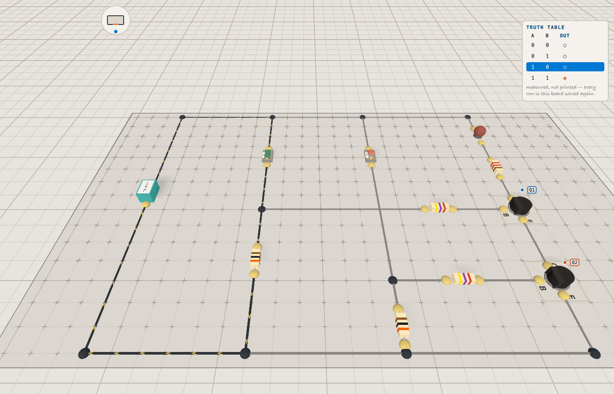

***AND*** *— the two transistors stacked in series down the right-hand
branch, with A high and B low. The lamp is dark and the table says so.*

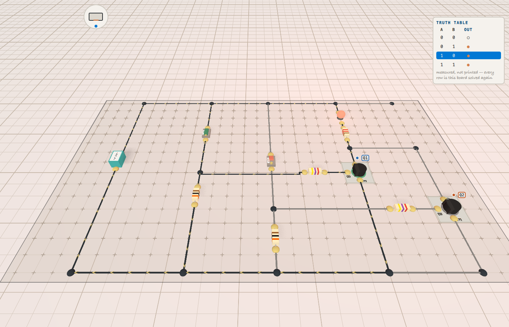

***OR*** *— the same two parts, now hanging off a shared collector rail. One
input is enough, and the lamp is lit.*

Three readings there are worth stopping on, and none of them is something
a truth table can tell you.

**In the AND at `1 0`, the transistor whose input is high is `off` too.**
Q1's emitter sits on Q2's collector, and with Q2 not conducting that node
floats up to 4.06 V — so Q1's base, at 4.5 V, is only 0.44 V above its own
emitter, short of the 0.7 V knee. *An upper transistor in a series stack
cannot switch on until the one below it does.* The gate is not "two
switches in a row that happen to both need to be closed"; the lower one
enables the upper one.

**In the AND at `1 1`, the two collector currents differ by exactly one
base current.** Q2 carries 9.78 mA where Q1 carries 9.02 — and
$9.02 + 0.76 = 9.78$, because Q1's *emitter* current is its collector
current plus its base current, and that is what flows into Q2. Kirchhoff at
a three-terminal part, visible in two readings.

**In the OR at `1 1`, the lamp gets 9.89 mA rather than twice 9.81.** The
current splits 4.94 mA each. The 220 Ω resistor and the LED set the
current, not the transistors, so opening a second path in parallel with an
already-saturated one buys almost nothing — the same lesson the two-bulb
presets teach, arriving from the other direction.

### XOR costs five transistors

XOR is the one that will not fall out of a wiring, because it is not
monotone: turning a second input on has to turn the lamp *off*. It is built
as $(A \lor B) \land \lnot(A \land B)$, which on the board is the OR pair
you have just built, sitting on top of a fifth transistor that a **NAND**
switches off:

- Q1 and Q2 in series with a 4.7 kΩ pull-up form the NAND. Its collector
  node is high unless both inputs are.
- Q3 and Q4 in parallel are the OR, in the lamp's path.
- Q5 sits under them, driven from the NAND node through 4.7 kΩ.

| A B | LED | NAND node | Q5 |
|---|---|---|---|
| 0 0 | dark | high | `sat` — but nothing above it conducts |
| 1 0 | **9.02 mA** | high, $V_{CE}(Q1) = 2.45\,\mathrm{V}$ | `sat`, 9.78 mA |
| 0 1 | **9.02 mA** | high | `sat` |
| 1 1 | dark | collapsed to $V_{CE}(Q1) = 0.154\,\mathrm{V}$ | `off`, $V_{CE} = 3.80\,\mathrm{V}$ |

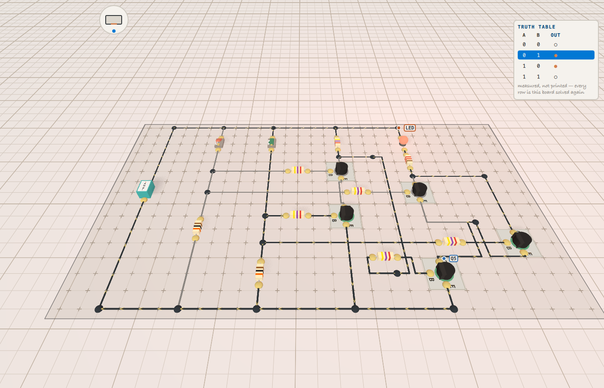

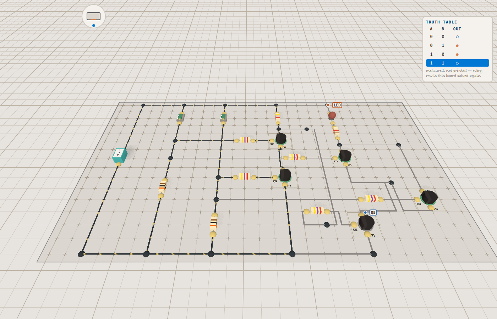

*The pair the gate is about, on one board with one switch moved. Above: A
high, B low, and the lamp lit. Below: both high — four of the five
transistors are now conducting (green collars) and the lamp is out, because
the fifth, bottom right of the output branch, has been cut off by the NAND.*

The last row is the whole gate. Both inputs are high, both OR transistors
are conducting, the supply is still there — and the lamp is dark, because
Q5's base is looking at 0.15 V instead of 4.5 V. **The cell draws 3.4 mA in
that row against 11.4 mA in the lit ones**: the current has not been
diverted, it has been refused.

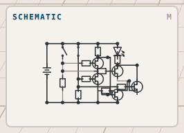

*Thirty-eight parts is where the lab's schematic view (`M`) stops being a
nicety: the same board, drawn the way a circuit diagram draws it, is the
only form of this circuit that can be followed with a finger.*

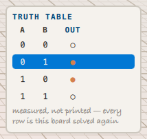

*And the panel that makes the claim checkable. It is not a table of XOR — it
is four solves of whatever is currently on the board, so erasing a wire
redraws it. The highlighted row is where the switches are standing.*

Thirty-eight parts and forty-seven wires for one bit of a decision. That
count is not a failure of the drawing — it is the honest price of XOR in
this technology, and it is the reason the picture of a modern chip is
worth having in mind while looking at the board.

## The gate as a package

Nobody builds that twice, which is the whole reason integrated circuits
exist. The kit therefore also carries a **gate**: one part, five pins, and a
function you set on it the way you set a resistor's ohms — `and`, `or`,
`xor`, `nand`, `nor` or `not`, printed on the case, with the schematic
symbol changing to match.

It is the only *behavioural* part in the kit, and the design decision that
keeps it electronics rather than algebra is where its output voltage comes
from. There is no invented logic-high anywhere in the model. The package has
**VCC and GND pins like a real chip**, and the output is pushed onto
whichever of those two pads it was actually given, through a 50 Ω output
resistance:

| | |
|---|---|
| inputs | 1 MΩ from each input pad to the GND pad, so a floating input reads low |
| supply | 100 kΩ VCC→GND — the quiescent draw of a chip doing nothing |
| threshold | ratiometric: high above $V_{CC}/2$, so it works at any supply |
| output | push-pull, 50 Ω, onto the VCC net or the GND net |
| unpowered | below 0.5 V of supply the output goes high-impedance |

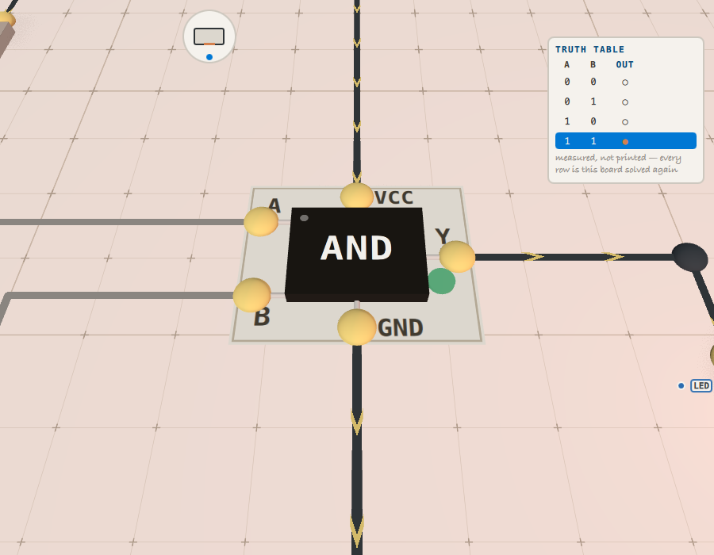

*One package with both inputs high. The pins are named on the board, the
function is printed on the case, and the green pip beside the output pin is
the level it is driving. The chevrons on the supply wires are not decoration
— that is the current the chip is drawing to do this.*

Measured on the `gates` preset (`10`) at 4.5 V, an AND package driving an
LED through 220 Ω:

| A B | output | $V_Y$ | $I_Y$ | LED | cell |
|---|---|---|---|---|---|
| 0 0 | low | 0.000 V | 0.00 mA | dark | 0.05 mA |
| 1 0 | low | 0.000 V | 0.00 mA | dark | 0.50 mA |
| 1 1 | high | **4.057 V** | 8.75 mA | **8.75 mA** | 9.71 mA |

Three things in that table are worth more than the boolean.

**The output high is 4.057 V, not 4.5.** The 50 Ω output resistance drops
0.44 V at 8.75 mA — a real chip's output is a *switch to the rail*, not a
perfect voltage, and it sags under load exactly like everything else in this
lab. **The cell draws 0.05 mA with both inputs low**: that is the quiescent
current, the price of having the chip on the board at all, and it is in the
network rather than in a footnote — 0.20 mW of it. And **unwire VCC and the
gate stops answering**: supply 0.000 V, `powered: false`, output
high-impedance, lamp dark, with both inputs still high. A chip with no power
is not a chip that outputs low; it is a chip that outputs nothing.

The state of that output — high, low, or high-impedance — is resolved on the
same assume-solve-re-check loop the diodes and the transistor already use.
That is what lets gates be *composed*: wire one output into the next input
and the answer settles out of the network, with nothing anywhere evaluating
a boolean expression.

### A half adder

Which is the point of having them. The `half-adder` preset (`11`) is two
packages reading the same two inputs — an XOR and an AND — and it is the
first thing gates were ever built for:

| A B | SUM | CARRY |
|---|---|---|
| 0 0 | ○ | ○ |
| 0 1 | ● | ○ |
| 1 0 | ● | ○ |
| 1 1 | ○ | ● |

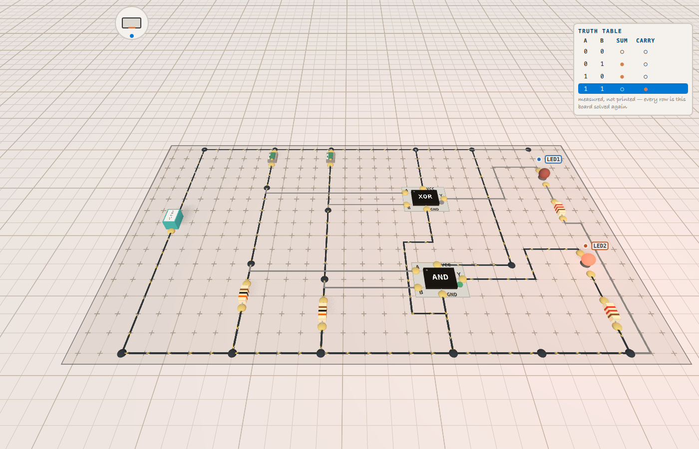

*Both inputs on: the SUM lamp is dark and the CARRY lamp is lit, which is
the bottom row of the table above and also the answer to 1 + 1.*

Read the bottom row as arithmetic rather than as logic: 1 + 1 gives a sum
of 0 and carries 1, which is how binary writes 2. Twenty-eight parts,
thirty-seven wires, twenty-five nets, and it settles in **two iterations**.

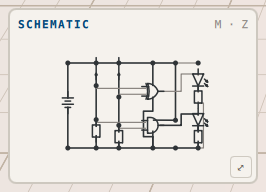

*And in the schematic view, where the ANSI shapes do the work the packages
cannot: the double curve is the XOR, the plain D is the AND, and neither
needs a word printed on it.*

The truth table panel grows a column per output here, and both are measured
the same way as everything else: eight solves of the actual board, four rows
by two lamps.

**Where this stops.** The gate is a threshold, a boolean and a 50 Ω output —
not a transistor network and not a real logic family. It has no propagation
delay, no fan-out limit and no noise margin, and wiring an output back to an
input does not latch: it oscillates until the solver's flip-lock pins it.
That is the same limit as everywhere else in this lab — there is no time in
the model — and it is why the arithmetic half of a processor is reachable
here and the sequential half is not. If the question is *how a gate is made*,
the five-transistor XOR above is the honest answer and this part is not.

## Short circuit vs. heavy load

These are different faults and the lab used to conflate them: any battery
current above 1.5 A raised a *SHORT CIRCUIT* banner. Two 6 Ω bulbs in
parallel are 3 Ω, so the same, perfectly sound wiring was silent at 4.5 V
(1.29 A) and accused of a short at 5.5 V (1.57 A). The threshold was
measuring the wrong quantity.

A short is not "a lot of current" — it is the **external resistance
collapsing to the order of the cell's own**. The solver now computes what
the cell actually sees,

$$
R_\mathrm{ext} = \frac{V_\mathrm{term}}{|I|},
\qquad V_\mathrm{term} = \mathrm{EMF} - |I|\,R_\mathrm{int}
$$

and calls it a short when $R_\mathrm{ext} < 2R_\mathrm{int}$. Two parallel
bulbs sit at $R_\mathrm{ext} = 3.01\,\Omega$ at *every* voltage — never a
short, however hard you push them; past the cell's 1.5 A rating they are
merely an **overload**, which now says so in its own words and colour.

The explanation is visual, and the widget is reusable: selecting a battery
shows a **`BudgetBar`** (in `Clayground.Lab`) splitting the EMF into what
reaches your parts and what is lost inside the cell. On a healthy circuit
the bar is almost all teal. On an overload a clay sliver appears — the cell
is starting to eat its own voltage. On a real short the bar goes **entirely
red**: every volt is burned internally, nothing is left for the parts, which
is precisely why they go dark. Wires past the rating are drawn in alarm
colour on the board and in the schematic, so the bypass path is visible as
the thing carrying everything. A `BudgetBar` answers "where does it all go?"
for any conserved quantity — volts round a loop, current at a junction,
power in a machine — so other labs can borrow it as-is.

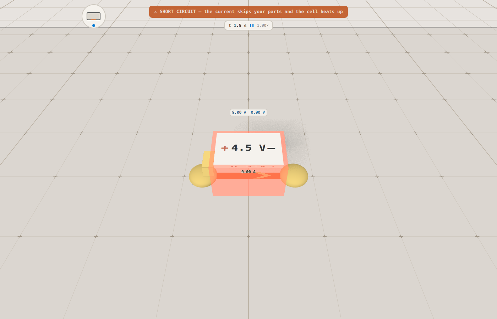

*A single wire from $+$ to $-$: the banner drops and the wire carrying 9 A is
drawn in alarm colour.*

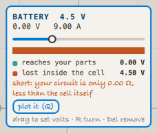

*The same cell's budget bar —* **0.00 V reaches your parts, 4.50 V is lost
inside the cell.**

The bar is the argument. "A short is bad" is a rule to memorise; *every volt
you paid for is being burned inside the battery, so there is none left for
anything else* is a thing you can see, and it explains the dark parts in the
same picture that shows the fault.

## Stated simplifications

- **DC only.** No capacitors, inductors or AC sources — the solver has no
  notion of time or frequency, only a steady operating point.
- **Ideal wires.** A wire has exactly zero resistance; it merges two
  terminals into one net. All contact resistance lives in the parts
  (closed switch and ammeter at $0.01\,\Omega$), never in the wiring.
- **The gate is behavioural.** A threshold, a boolean and a 50 Ω output —
  not a transistor network and not a real logic family (no TTL/CMOS
  distinction, no noise margin, no fan-out limit, no propagation delay).
  It is the level of abstraction at which "two of these make an adder" is
  the interesting sentence; the five-transistor XOR is the level at which
  "this is how a gate is made" is.
- **Diodes as piecewise-linear.** A hard knee at $V_F$ then a constant
  slope ($15\,\Omega$ for an LED, $10\,\Omega$ for a plain diode), not the
  smooth Shockley $I = I_S(e^{V/nV_T}-1)$. Reverse breakdown is not
  modeled — a reversed diode is simply open.
- **The transistor is a switch with a gain, not a device model.** $\beta$
  is a constant 100: it does not fall off at high current, does not vary
  with temperature and does not differ between two parts. There is no
  junction capacitance and therefore **no switching speed** — a gate here
  settles instantly, so propagation delay, fan-out limits and race
  conditions are all outside the model. Anything *sequential* is out of
  reach for the same reason: a flip-flop wired up here has no defined
  state, because the feedback loop it depends on is exactly the transient
  the solver has no notion of. Only NPN exists, so CMOS cannot be built.
- **Cut-off leakage is a chosen number, not a measured one.**
  $10^{7}\,\Omega$ base-emitter and $10^{8}\,\Omega$ collector-emitter,
  picked to sit decades below an open switch for the reason argued above.
  Sound as a ranking; not a claim about any real part.
- **Constant bulb resistance.** The filament is a fixed $6\,\Omega$; a
  real incandescent's resistance climbs several-fold as it heats, so its
  true cold-inrush and warm-running currents differ. Brightness here is
  read straight off dissipated power.
- **Ideal cells.** A battery's voltage is whatever you set on it (each cell
  has its own, so a board can mix a 1.5 V and a 9 V one); only its internal
  resistance limits current. Real cells sag and run down — these do not.

## Measured results

Default board, `batteryV = 4.5 V`, read live off the running lab
(the solver also carries a 169-case node unit suite — Ohm's law, switch
open/closed, LED forward and reversed-dark, series/parallel bulbs, short
detection, meter readings, floating elements, parallel-LED current
sharing, the transistor's three regions, the complete truth table of every
gate below, and all six functions of the gate package):

| scenario | battery current | per-element reading | result |
|---|---|---|---|
| **led-basic** (470 Ω + LED), switch open | 0 mA | everything 0 mA | dark |
| **led-basic**, switch closed | 5.15 mA | LED 5.15 mA · $V_\mathrm{LED}$ 2.08 V · ammeter 5.1 mA | LED lit |
| **series** (two 6 Ω bulbs) | 360 mA | 360 mA through both · 0.78 W each | both dim |
| **parallel** (two 6 Ω bulbs) | 1282 mA | 641 mA per bulb · 2.47 W each | both near-full |
| **reversed LED** (anode to −) | 0 mA | pinned off | dark |
| **dead short** (wire + to −) | 9 A | — | short flag · red battery · banner |
| **transistor**, switch closed | 11.1 mA | $I_B$ 0.803 mA · $I_C$ 9.81 mA · $V_{CE}$ 0.189 V | LED lit, `sat` |
| **logic-and** `1 1` | 11.5 mA | Q1 9.02 mA · Q2 9.78 mA | LED lit |
| **logic-or** `1 1` | 12.4 mA | 4.94 mA per transistor | LED lit |
| **logic-xor** `1 0` | 11.4 mA | Q5 9.78 mA, NAND node 2.45 V | LED lit |
| **logic-xor** `1 1` | 3.4 mA | Q5 `off`, NAND node 0.154 V | LED dark |
| **gates** (AND package) `1 1` | 9.71 mA | $V_Y$ 4.057 V · $I_Y$ 8.75 mA | LED lit |
| **gates**, VCC unwired | — | supply 0.000 V, output high-Z | LED dark |
| **half-adder** `1 1` | — | SUM dark, CARRY lit | 1 + 1 = 10 |

Readings worth chasing to their equations. The lit LED draws

$$
I = \frac{V - V_F}{R + R_\mathrm{LED} + R_\mathrm{int} + 2R_\mathrm{shunt}}
  = \frac{4.5 - 2.0}{470 + 15 + 0.5 + 0.02} = 5.15\,\mathrm{mA},
$$

and the voltmeter across it reads $V_F + I\,R_\mathrm{LED} =
2.0 + 0.00515 \times 15 = 2.08\,\mathrm{V}$ — the knee plus the drop on
the internal slope. The dead short is limited only by the battery's own
$0.5\,\Omega$: $4.5 / 0.5 = 9\,\mathrm{A}$, which trips the
$1.5\,\mathrm{A}$ short flag.

The headline is the series-versus-parallel pair. **Same two bulbs, same
battery, only the wiring differs**, yet the battery delivers 360 mA in
series and 1282 mA in parallel — roughly $3.5\times$. Series stacks the
resistances ($0.5 + 6 + 6$) so the shared current is small and both bulbs
barely glow; parallel halves them ($0.5 + 3$) so each bulb gets nearly
the full cell and blazes. That contrast, produced by rewiring alone, is
the core physical lesson of the lab.

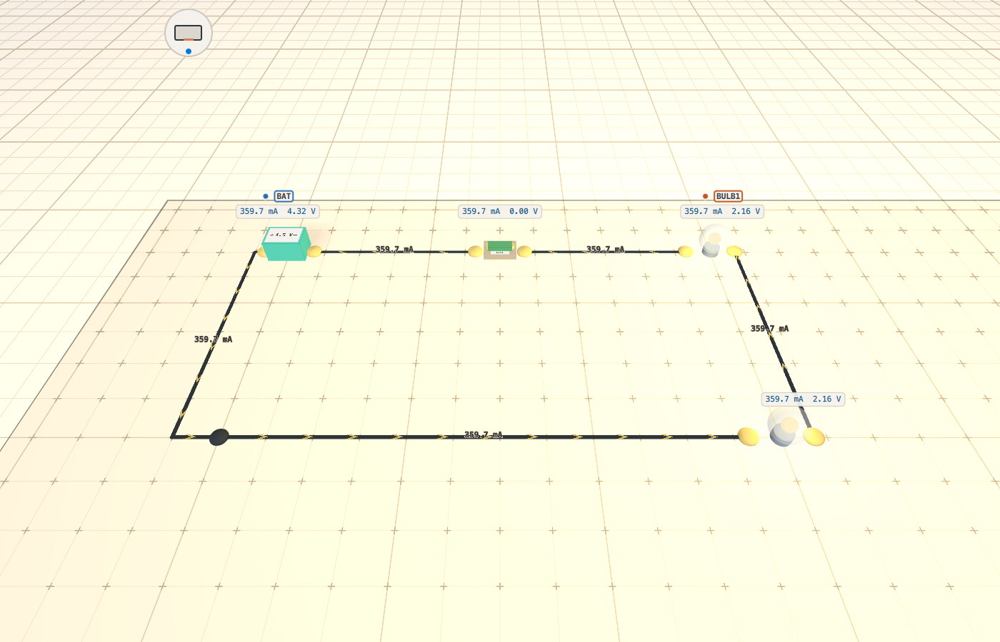

***series*** *— one loop, so 359.7 mA appears on every wire and the cell's
volts divide, 2.16 V to each bulb.*

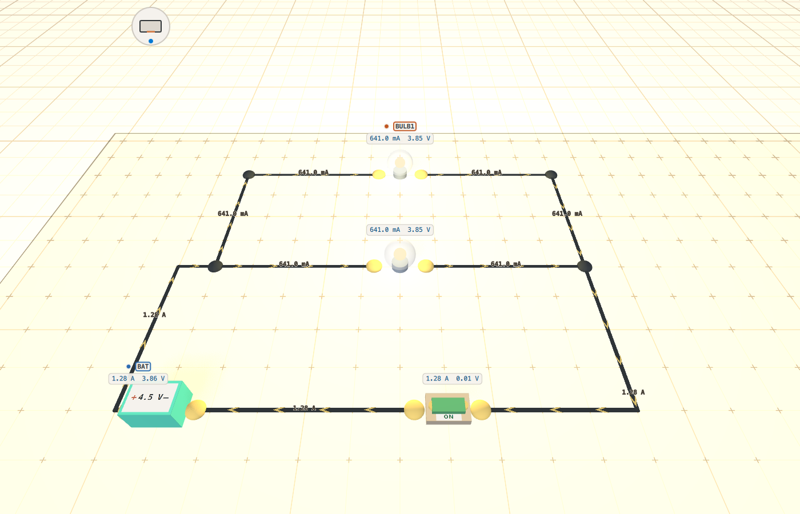

***parallel*** *— a ladder, so both bulbs sit across the same 3.85 V and the
current splits, 641 mA each, rejoining at the rails.*

Same two bulbs, same cell, same switch. The only difference is which wire goes
where — and it is visible before you read a single number, in how brightly the
two pairs glow.

## The same contrast, run as a study

The two rows above are one voltage of a question that deserves a sweep, so
the lab carries one: **`studies/series-vs-parallel/`** asks what the wiring
decides across the cell's whole usable range, 1.5 V to 12 V, twelve runs
driven headlessly by `tools/lab-sweep` and committed as twelve run records.
The study document states the question, argues its own answerability against
this kit's model card, and only then reports; everything below is quoted from
`studies/series-vs-parallel/results.md`, which is generated from the records
rather than typed.

Three findings, and the third is the one this table could not have shown:

1. **Parallel delivers 3.18× the power, at every voltage.** Not approximately
   — the same figure at all six levels, because both wirings are linear in
   the cell's EMF. Turning the cell up cannot turn a series board into a
   parallel one; the choice of wiring is a property of the circuit.
2. **It asks for 3.564× the current to do it.** The two ratios differ, and
   the gap is what the cell keeps for itself: a series board gets **96 %** of
   the cell's volts to its bulbs, a parallel board **86 %**. The honest form
   of "parallel is brighter" is *parallel asks for 3.56× as much and gets
   3.18× as much back, because a cell takes a bigger cut when you lean on it.*
3. **Only one of them ever reaches the cell's rating.** Computed from each
   record's own $R_\mathrm{ext} = V_\mathrm{term}/|I|$, the parallel board
   crosses 1.5 A at **5.27 V** and is over it from 6 V up; the series board
   would need **18.8 V**, which is past the cell's ceiling. Neither is ever a
   short — 3.01 Ω is still six times the cell's own 0.5 Ω, however hard it is
   pushed, which is the distinction argued above being checked rather than
   asserted.

`R_ext` is 12.01 Ω in series and 3.01 Ω in parallel, read off the records as
$V_\mathrm{term}/|I|$ — the two bulbs stacked against the two bulbs halved.
Every other number in the study follows from those two by Ohm's law, which is
why none of the ratios move with voltage.

## Things to try

- **Push the LED to its ceiling.** Set the resistor to 100 Ω and drag the
  battery's own slider up to 12 V. The current climbs but the LED clamps near its
  $V_F$ knee — most of the extra volts now burn in the resistor, not the
  diode. Put the LED and the resistor on the plot, switch it to *voltage*,
  and watch the LED's curve flatten while the resistor's climbs.
- **Read series and parallel off one plot.** Both presets seed the monitor
  with the cell and one bulb. In `series` the two current curves lie on top
  of each other (one current everywhere) while *voltage* shows the cell's
  volts shared out; in `parallel` the currents separate exactly 2:1 while
  the voltages coincide. Same two curves, opposite lessons.
- **Build both bulb circuits and compare.** Press `2`, read the battery
  current, press `3`, read it again. Feel the $3.5\times$ jump — then
  notice the parallel bulbs are the bright ones. Same parts, different
  wiring, different physics.
- **Reverse an LED on purpose.** Wire its anode (the gold foot) to minus.
  It stays dark at exactly 0 mA. Polarity is real, not decorative.
- **Meter a divider.** Load the `metering` preset (`4`): the ammeter sits
  in series and reads loop current, the voltmeter sits across the LED and
  reads its drop. Cycle the resistor (click it) and watch both readings
  move together.
- **Make a short.** Run a single wire straight from $+$ to $-$. 9 A, the
  battery flashes red, the banner drops. Now put a resistor in that wire
  and watch the short clear — that is what a resistor is *for*.
- **Starve a base and watch the region change.** Load `transistor` (`5`),
  select the 4.7 kΩ base resistor and drag it up. The lamp dims, and the
  selection card's region flips from *saturated* to *active* at the point
  where $\beta I_B$ falls below what the lamp wants — which is the whole
  definition of saturation, arrived at by turning one knob.
- **Break an AND gate on purpose.** In `logic-and` (`7`), erase the wire
  between the two transistors and rewire them in parallel. The truth table
  redraws itself as an OR, because it is not a table — it is four solves of
  whatever is on the board.
- **Find the row that costs the least.** In `logic-xor` (`9`), watch the
  cell current as you walk the four rows: 0.4 mA, 11.4, 11.4, 3.4. The
  gate's *answer* and the gate's *appetite* are different quantities, and
  the dark rows are not the cheap ones in the way you would guess.
- **Take a diode out of the diode OR.** In `diode-or` (`6`), delete D2 and
  wire B's input node straight to the lamp. The lamp still lights from A
  alone — but B's input, which read **0.000 V**, now sits at
  **3.719 V**, driven by A through the lamp it was supposed to be
  independent of. The diode was not there to make the gate work; it was
  there to keep the two inputs from becoming one.
- **Turn one gate into six.** Load `gates` (`10`), select the package and
  click through AND, OR, XOR, NAND, NOR, NOT. The case relabels, the
  schematic symbol changes shape, and the truth table is *re-solved* each
  time — four fresh solves of the board, not a lookup.
- **Starve a chip.** In the same preset, erase the wire from the plus rail
  to the package's VCC pin. Both inputs stay high and the lamp goes out:
  supply 0.000 V, output high-impedance. A chip with no power does not
  output low, it outputs nothing — which is a different fault, and one you
  can see the difference of here.
- **Read an adder as arithmetic.** In `half-adder` (`11`) walk the four
  rows and read SUM and CARRY as a two-digit binary number: 0, 1, 1, 10.
  That is addition, done by two parts and a battery.
- **Clip a meter on and keep what it says.** Press `H` until the voltmeter
  (`⚡`) is in your hand, click a bulb, and it reads that bulb live while you
  keep working. Press `P`, give the reading a name, and it becomes a probe
  like any other — on the plot, in the recording, and in a run record a paper
  can cite. It is the shortest path in the lab from *I wonder* to *a number
  somebody else can check*.

## Run it

```bash
./build/bin/claydojo --sbx labs/electronics-101/Sandbox.qml
```

Keys: `1` led-basic · `2` series · `3` parallel · `4` metering ·
`T` the guided flow · `E` eraser · `C` clear · `V` value labels ·
`M` the schematic · `#` grid mode · `R` turn the selected part ·
`Q` put it on the plot · `Del` remove it · `F` frame it · `0` reset the
view · `H` the next instrument · `P` keep a reading · `Esc` cancel ·
`Shift+R` record a run. `EN`/`DE` in the top right switch the language.

Take a part from the palette by clicking it: a semi-transparent **ghost** of
that part then follows the cursor at the cell it would snap to, a click puts
it there, and `Esc` or a right-click puts it back down. The ghost is drawn
in the refusal colour where the cell is already taken, so a placement that
will not work says so before the click rather than after it. Click two gold
terminals to wire, click a switch to flip it, click a resistor to cycle its
ohms, drag a part to move it, and click a wire anywhere along its length to
branch off it (the eraser removes wires, junctions and parts alike). Every
preset starts with the switch **open** — flipping it is the invitation.

Parts try to say what they are without a legend. The palette shows each
part's **schematic symbol** (IEC 60617) next to its colour, because the
palette is the one place a kit can teach *this lump is that squiggle* for
free. On the board, several parts are **printed with Qt Quick items rendered
to textures**: a battery carries its polarity and its voltage on a paper
label, a switch prints `ON`/`OFF` (a tilted lever is hard to read from
straight above), and each meter has a real dial — scale, needle, and an
auto-selected range, so an ammeter reading 5 mA switches itself to a 10 mA
scale and says so. A resistor needs no print: its bands are the actual
colour code, two significant digits plus a decade, so they change with the
value the way a bought resistor's do.

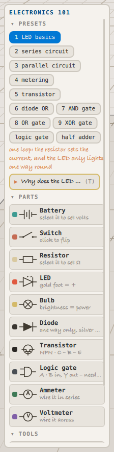

*The palette, actual size. Every part carries the symbol it becomes on a
circuit diagram, next to the colour it has on the board — so the translation
from a lump on a pegboard to a squiggle in a textbook is made once, in the
place you are already looking, and never has to be taught.*

Values are set where the part is, not in a global panel. Selecting a
resistor puts a slider on its card that walks the **E12 series** — the
values a shop actually sells — and selecting a battery gives it its own
volts, so a board can hold a 1.5 V cell next to a 9 V one. There is
deliberately no global voltage parameter any more: one slider per cell is
both simpler to explain and strictly more capable.

`M` toggles the **Schaltplan**: a live schematic of the board in the corner,
drawn with the same symbols the palette shows — parts where the parts are,
lines where the wires are, energised wires in ink and idle ones faint. It
fits itself to what you built. The 3D board shows what you assembled; the
schematic shows what it *is*, and watching both at once is how the diagram
in a textbook stops being an abstraction.

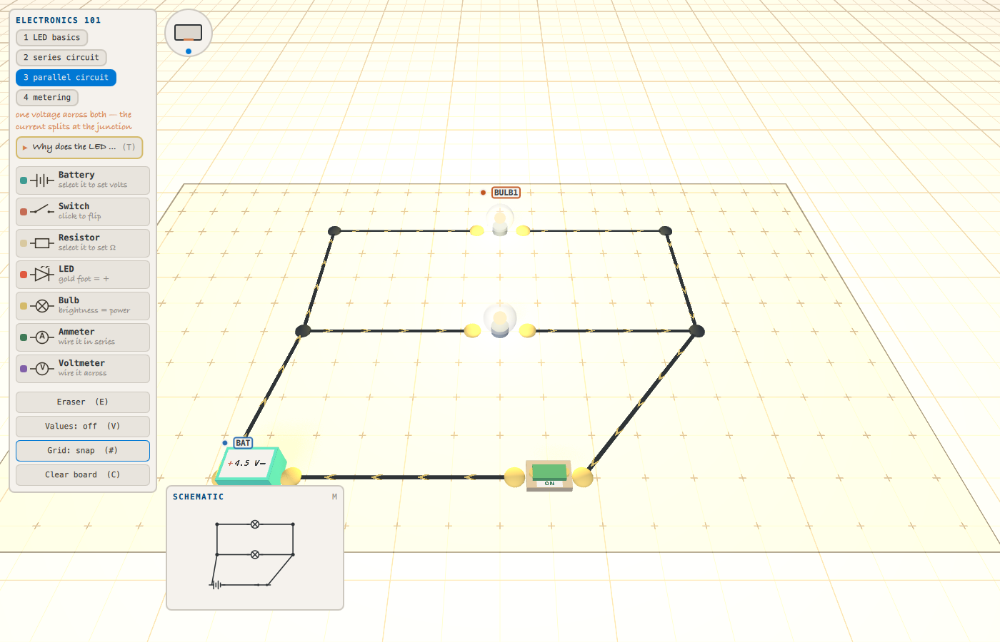

*The same parallel circuit, twice: the ladder you built on the pegboard, and
the ladder as a circuit diagram in the corner. Neither is a picture of the
other — both are drawn from the same list of parts and wires, which is why
moving a part moves it in both.*

`Z` gives that diagram the whole window, and `Z` or `Esc` puts it back in its
corner. This is one canvas at two sizes, not two views: the same symbols, the
same routed wires, the same model. What changes is how much room there is to
say things. In the corner, none — at map size the symbols are barely thirty
pixels apart and a two-line label would cover the neighbour it belongs beside,
so the small diagram says nothing rather than saying it illegibly. Filling the
window there is room to **letter every part**: its designator, and what it is
rated at — `R4 / 4.70 kΩ`, `BAT / 4.50 V`, `IC1 / XOR`. With values on (`V`)
each label grows a third line with what the part is actually *doing*, and a
transistor's says which region it is working in.

That split is deliberate. A rating is a fact about the part you chose and is
true with the power off; a reading is a fact about the circuit and changes when
you flip a switch. A diagram that ran them together would be teaching that the
two are the same kind of number.

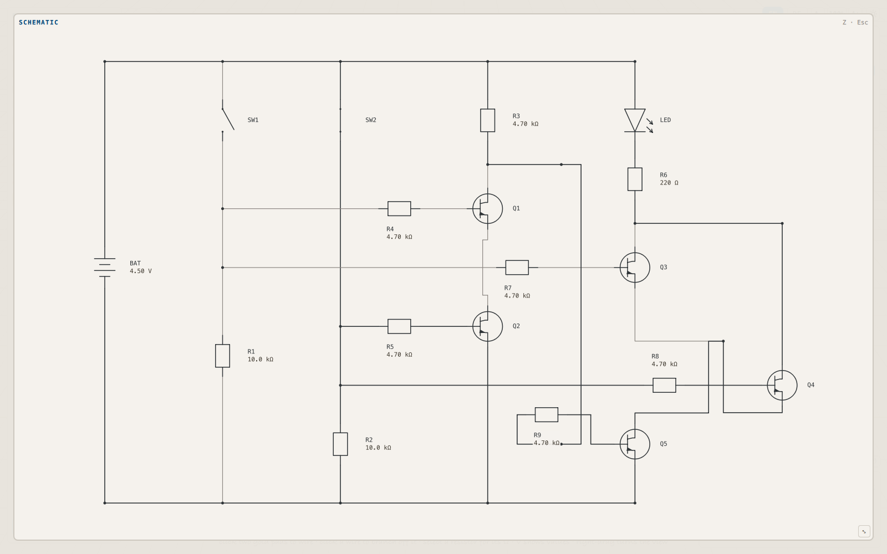

*The XOR preset with the diagram given the window: twenty parts, every one of
them named and rated. Nothing here is drawn that the postage-stamp version does
not also draw — the lettering is the whole difference, and the lettering is
what a small panel has no room for.*

Where the text goes is `labs/kits/circuit/plan.js`, and it is a real problem
rather than an offset: a label is offered four sides in turn and takes the
first on which it covers no symbol, no label already placed, and no wire — text
laid across a conductor reads as a break in it. A label with nowhere clear to
go is not dropped, because an unnamed part is a worse diagram than a crowded
one; it gets a small card under it instead, which is what a draughtsman does
with a note that has to sit over a wire.

The big diagram is also a way of *navigating* the circuit: hovering a symbol
highlights that part on the board behind, and clicking one selects it, so the
selection card and the plot follow from the diagram as readily as from the
board.

Wires meet at **junctions**: click any wire and a solder dot is dropped
where you clicked, splitting it in two and starting a branch from that point
— which is what makes a real parallel circuit buildable instead of a star of
wires from one terminal. A junction is electrically neutral (a short between
its two coincident terminals), so inserting one never changes a reading. The
`parallel` preset is built from them and is laid out as a ladder — two rungs
between two rails, source at the bottom — because a parallel circuit that
looks like a tangle teaches the wrong thing.

The lab speaks **English or German**, switched by the `EN`/`DE` chips in the
top right corner while it runs. Translation is a runtime dictionary
(`LabLang` in `Clayground.Lab`), not `qsTr`: retranslating a live QML engine
is a C++ call on the engine, which a lab hosted by the dojo — or exported to
the web — never owns. Every string is therefore an ordinary binding that
re-evaluates when the language changes, including the text printed *onto*
the parts, so a switch reads `EIN`/`AUS` in German. Numbers switch with the
words: German shows `4,32 V` and `641,0 mA`, in the plot's axis and legend
too, because that is how a student writes it in their exercise book. The
kit owns the part vocabulary (`labs/kits/circuit/strings.js`), the lab its
own copy (`labs/electronics-101/strings.js`), and a lab may override a kit's
wording by registering later. Key letters are physical and never translated:
`Q`, `V`, `R` and `#` are the same on a German keyboard.

The **monitor** in the corner plots the board, not a fixed pair of curves.
Select a part and press `Q` (or hit *plot it* on its card) and it gets a
probe, a colour and a curve; the same colour appears as a small tag on the
part, so *which line is which* is read off the board instead of inferred
from the legend order. Clicking a legend entry drops that curve again, and
deleting a part takes its curve with it. Presets seed a watch list that
suits what they are about, and an empty board says so instead of showing
leftovers.

One quantity is plotted at a time — *current*, *voltage* or *power*, by the
chips above the plot. That is partly honesty (all series share one
autoscaled axis, so mixing mA with V would flatten the volts onto the
baseline) and partly the lesson: the same two parts tell you about series
wiring under *voltage* and about parallel wiring under *current*. Switching
quantity clears the curves, because the axis is no longer the same axis.

`V` toggles **value labels**: every part shows its current and voltage and
every wire its current. That one toggle is the lab's whole argument, made
readable: in series the same current appears on every wire while the
voltages divide; in parallel the same voltage sits across both rungs while
the current splits and re-joins at the junctions.

Hovering a part draws a thin blue outline around it on the paper, the same
blue the terminals light up in; clicking **selects** it, which thickens that
outline, adds a nose mark showing which way the part faces, and opens a card
reporting its voltage and current. `R` turns it in 90° steps — wires
follow the terminals. (The right button belongs to the camera in every lab:
a right drag turns the view, a right click puts down whatever is in hand.) Moving is grid-snapped by default, exactly like
grafli's grid mode: the pegs are drawn as small squares while snapping and
as round dots when parts move freely, `#` cycles the mode and holding `Alt`
inverts it for one drag. The peg raster is 5 world units — half a part
width — so snapped parts can still be nudged in fine steps; `cellFree`
therefore keeps two pegs of clearance around every part.

Shadows are **real** — a GPU shadow map on the key light, so they follow
whatever you move. Two things make them legible at this scale:

- **A small shadow volume.** `shadowMapFar` bounds the map to the board and
  the table instead of the horizon (a table the size of the horizon starves
  the map), and two cascades spend their texels near the camera. The far
  plane still has to cover the setup at full zoom-out, since the range is
  measured from the camera, not from the light.
- **A small bias.** `shadowBias` at 3 works; at 10 and up thin shadows are
  pushed off the board entirely and at 0 the whole board turns to acne. It
  was worth measuring rather than eyeballing — the failure at both ends
  looks identical from a distance ("no shadows").

Wires lie **flat on the board** and are drawn as one instanced line batch
(`LineBatch3D` in `Flat` orientation), which is what buys the current
animation: each wire is an ink line with a chevron pattern marching along it,
speed bucketed by current magnitude, pointing the way the current actually
runs. No current, no chevrons — so an open switch or a backwards LED is
visible at a glance instead of only in the numbers. Parts are sunk slightly
into the board and their terminals are near-flush pads, so the wires meet
them at board level. Nobody expects a shadow from a line lying on paper, so
shadows are now a question only for the parts, where they work.

### Wires turn corners

A wire used to be the straight line between two pads. On the one-loop boards
that is invisible, because the pads are already in line; on the XOR it is
thirty-eight parts joined by a fan of diagonals, and a diagonal has no
relationship to the grid the parts stand on. Every board people solder and
every diagram people draw runs its wires along two axes.

`labs/kits/circuit/route.js` therefore routes each wire as a **Manhattan
path**, on three rules. First, a lead leaves along its pad's own side — the
direction is read off the pad's offset from the middle of the part, so a
resistor's wire leaves the end of the resistor and a transistor's base lead
leaves the base side. Without that rule an orthogonal path is merely
orthogonal, and can still start by crossing the part it belongs to. Second,
two pads already in line still get the straight wire, unless a part is
standing in that lane or another wire is already running along it: that is
what leaves every rail on every preset exactly as it was, and what makes the
voltmeter's leads loop **around** the LED they are measuring instead of
lying on top of the wire already in that row. Third, where the route turns is
chosen by scoring a handful of candidates: crossing a part it is not wired to
is expensive, entering a pad from the wrong side nearly as expensive, each
corner costs a little, each unit hidden under an already-routed wire costs a
little more, and length costs least. Candidate turning points include the
sides of the nearby parts themselves, which is what lets a route pass a part
by a hair rather than miss it by one.

Routing is geometry, so it is recomputed when the board moves and never when
the currents change — a search over candidate paths has no business inside
the solve loop. All the wires are routed in one pass rather than one at a
time, because a wire has to know which lanes are already taken; the order of
the list decides who keeps a lane and who goes round, and the same board
always produces the same paths.

The measured result, over the eleven preset boards: no diagonal segments, no
wire laid across a part it is not wired to, and the longest stretch of one
wire hidden under another down from 23 units to 10. It costs 20 ms to route
the XOR's 47 wires, paid once per board change.

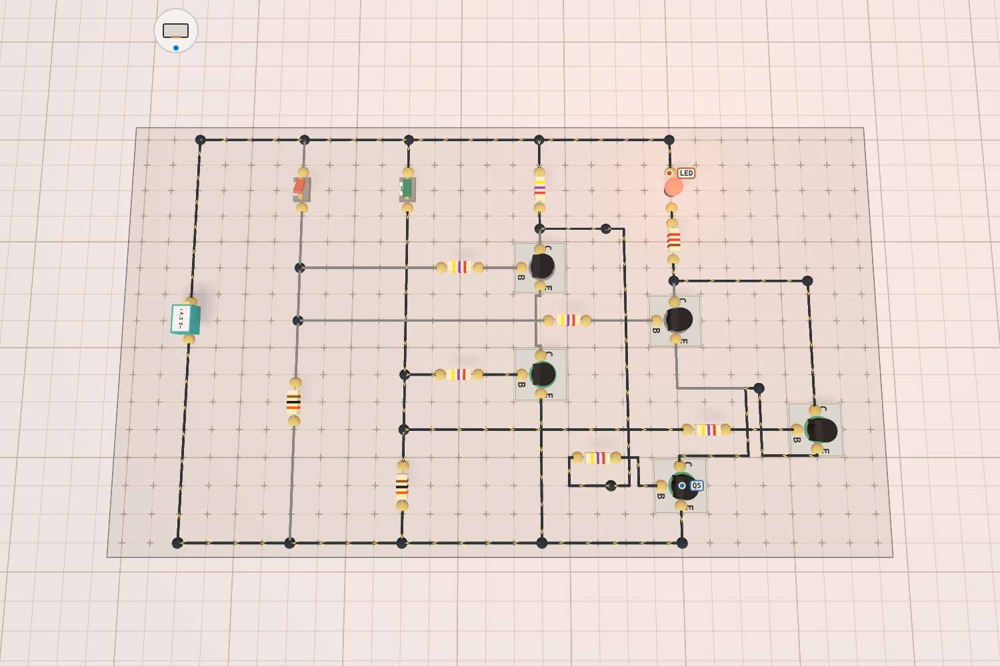

*The XOR from as far overhead as the camera goes. Thirty-eight parts,
forty-seven wires, and every one of them runs along one of two board
directions — two families of parallel lines and no third. (The board still
shears slightly: 84° is the rig's limit, not 90°.) No wire is laid over a part
it is not wired to.*

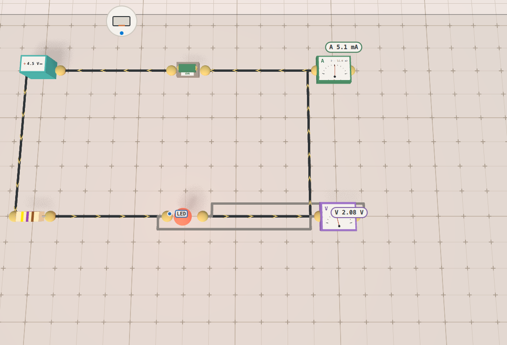

*A voltmeter wired across an LED sits in the LED's own row. A straight lead
would be drawn exactly on top of the wire already there and neither would be
readable, so the two leads loop round instead — which is also how a diagram
draws a meter across a part.*

The schematic view is drawn from the same paths, which is the point at which
it stops being a sketch of the board and starts being a circuit diagram.

Giving each wire a direction needs a little care. A wire cannot be oriented
by voltage: in this model a wire **is** the net (ideal, zero resistance), so
both of its ends sit at exactly the same potential by construction. What is
known is every element's current, so `attributeWireCurrents` derives the
wires from Kirchhoff's current law: repeatedly find a terminal where only one
wire's current is still unknown, and that wire's current follows from the
others. Tree-shaped wiring resolves completely; a genuinely ambiguous wire
(two wires in parallel between the same two terminals) stays unknown and
simply does not animate, which is the honest answer.

The view is an orbit cam on a leash, and it never takes the left button (see
*The left button is the lab's* below). A right drag circles the setup, a
middle drag slides it, the wheel zooms at the cursor, `WASD` and the arrows
pan, `Shift` with the arrows turns, `F` frames the selected part and `0`
reframes the whole setup — which is also what happens when a preset is
applied, so each scenario arrives properly framed. Holding `Space` lends the
left button to panning for exactly as long as it is held, for anyone who
would rather drag than press a key. Two rules keep you oriented: the camera
always looks at the setup (there is no free-flying pivot), and it must stay
at least 9 units above the board plane, so flattening the angle backs the
rig off instead of letting it dive through the parts. The compass under the
palette shows the board turning against a fixed marker for you, and the
table under the board gives a horizon at low angles.

Agents attach via `.clay/inspect/` (`Lab.labInfo()` reports the element
counts, net count, iteration count and the short and overload flags, plus
which parts are being watched and in which quantity). Three probes are
setup-independent and always registered — `iBattery`, the total supply
current, `power`, the total dissipated in the loads, and `vTerm`, what the
cells actually hand to the parts after their own internal drop — so a
recording has stable columns whatever the board looks like. Every watched part adds a `part<id>` probe
next to them, which is also the agent-facing way to plot something:
`setWatched(id, true)`. The entire
circuit — elements, wires, positions, rotations, switch states — plus the
camera pose rides in the dojo `viewState`, so the board you built and the
angle you were watching from both survive a QML reload untouched; a user's
board even wins over a scenario preset on reload.

## Instruments you hold

An instrument in a lab used to be one of two things: bolted into the scene,
or parked in a corner of the screen. Both are **mounted** — the author
decides what they measure, and the learner only reads them. A tape measure
is neither. What it measures is whatever you point it at, and pointing is
the whole instrument.

So there is a third way to hold one, and it is the ordinary one: the strip
along the bottom edge of the screen is a **belt**, `H` walks along it, and
whatever is in your hand takes the next left click.


*The belt, actual size, with the voltmeter taken out — the lit chip is what
the next click will do. `Resistor` sits on the same strip as the meters,
because taking a part to place is taking an instrument too.*

Three instruments ride there in every lab, undeclared:

- **the tape measure** (`📏`) — two clicks are two places, and the reading is
  the distance between them. Here it answers *how far apart are those pads*
  without touching the board.
- **the stopwatch** (`⏱`) — clicks are moments on the simulated clock, not
  places, so it needs no aim at all. The same contract, with the pointing
  removed.
- **the voltmeter** (`⚡`) — a click names a **part**, and the meter stays
  clipped to it, reading live. This one is the circuit kit's, not the
  kernel's: it is a handheld instrument a kit ships, which is the point of
  having a written contract for them.

A reading you want to keep is kept with `P`, which asks what to call it and
then registers it as an ordinary **probe** — so a measurement somebody took
by hand joins the plot, the recording and the run record, under the name they
gave it. That is the whole path from a click to a citable number, and it is
why `pin` exists rather than a screenshot.

And the palette is on the same belt, which is the part worth noticing:
**taking a part to place is taking an instrument.** A build tool is just an
instrument whose reading is an act — it takes a place and, instead of
remembering it, puts something there. That is what lets building and
navigating happen without switching between them.

### The left button is the lab's

One rule holds all of that up: **the camera never takes the left button.**
Orbiting is a right drag, sliding is a middle drag, zooming is the wheel,
and everything else is on the keyboard. The left button belongs to whatever
the lab is doing — flipping a switch, wiring two pads, placing a part,
measuring between two pads — and no camera state can take it away.

The test the design is held to is stated as a failure: *if a lab's tool can
be starved of the left button by any camera state, the design is wrong.* It
had been wrong. Placing parts used to be a mode, and while you were in it the
switch on the board could not be flipped, because the camera had the press.
Removing the mode removed the bug; the ghost that now previews a placement is
what the mode had been standing in for.

`Space` is the one exception, and it is a quasimode rather than a mode: it
lends the left button to panning for exactly as long as it is held down.

## Source map

- Lab scene, palette, wiring and interaction: `labs/electronics-101/Sandbox.qml:1`
- DC nodal solver (`solve`): `labs/kits/circuit/circuit.js:107`
- Nets via union-find (`buildNets`): `labs/kits/circuit/circuit.js:41`
- Gaussian elimination (`solveLinear`): `labs/kits/circuit/circuit.js:68`
- Element conductances / Norton stamps: `labs/kits/circuit/circuit.js:92`, `labs/kits/circuit/circuit.js:135`
- LED piecewise model and flip-lock iteration: `labs/kits/circuit/circuit.js:124`, `labs/kits/circuit/circuit.js:146`
- Part visuals (LED glow, bulb glow): `labs/kits/circuit/CircuitElement3D.qml:1`, `labs/kits/circuit/CircuitElement3D.qml:136`, `labs/kits/circuit/CircuitElement3D.qml:171`
- Manhattan wire routing (`routeAll`, `routeOne`): `labs/kits/circuit/route.js:1`
- Which way a lead leaves its pad (`terminalDir`): `labs/electronics-101/Sandbox.qml:217`
- The routed paths, cached per board change (`wireRoutes`): `labs/electronics-101/Sandbox.qml:1312`
- Scenarios (each seeds its own watch list): `labs/electronics-101/Sandbox.qml:444`
- Fixed probes (`iBattery`, `power`, `vTerm`): `labs/electronics-101/Sandbox.qml:50`
- Watch list and the monitor: `labs/electronics-101/Sandbox.qml:100`, `labs/electronics-101/Sandbox.qml:1828`
- Board tags: `labs/electronics-101/Sandbox.qml:1572`
- The belt, and the palette as a tool on it: `labs/electronics-101/Sandbox.qml:721`, `labs/electronics-101/Sandbox.qml:731`
- The placement ghost: `labs/electronics-101/Sandbox.qml:796`
- The guided flow (`led-basics`): `labs/electronics-101/Sandbox.qml:1266`
- Handheld contract and belt (kernel): `plugins/clay_lab/HandheldInstrument.qml:1`, `plugins/clay_lab/InstrumentBelt.qml:1`
- Tape measure, stopwatch (kernel): `plugins/clay_lab/TapeMeasure.qml:1`, `plugins/clay_lab/Stopwatch.qml:1`
- The kit's handheld voltmeter: `labs/kits/circuit/Voltmeter.qml:1`
- The camera that never takes the left button (kernel): `plugins/clay_canvas3d/OrbitInput3D.qml:1`
- Runtime-driven plot series (kernel): `plugins/clay_lab/Plot2D.qml:50`
- Language switch (kernel): `plugins/clay_lab/LabLang.qml:1`, `plugins/clay_lab/LangSwitch.qml:1`
- Dictionaries: `labs/electronics-101/strings.js:1`, `labs/kits/circuit/strings.js:1`
- viewState circuit persistence: `labs/electronics-101/Sandbox.qml:412`
- The study, its records and its figures: `labs/electronics-101/studies/series-vs-parallel/study.md`
- This paper's figures, and the one script that regenerates them: `labs/electronics-101/figures/make.sh`

*Verified via the clay-crew inspector on the running lab: the readings
above are read straight from the probes and meter pills; the kit's node
suites cover the same circuits headless — 169 assertions on the solver, 54
on the router.*
