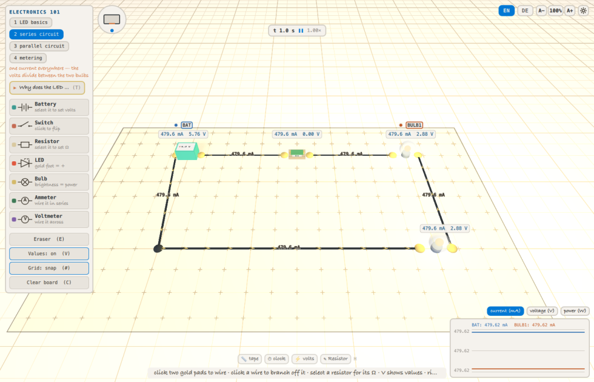
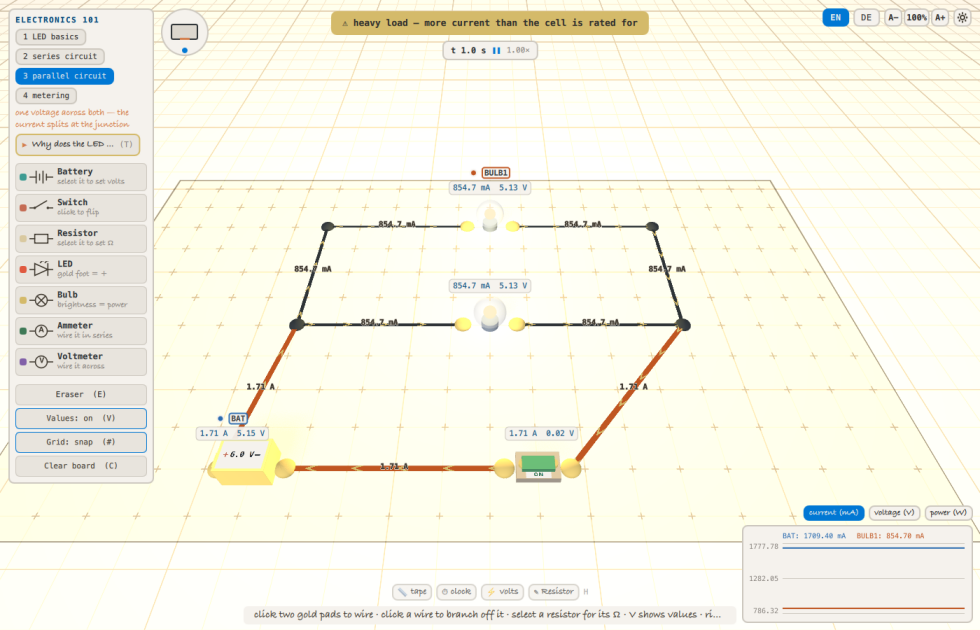

# Two bulbs, one cell — what does the wiring decide?

*A study against `labs/electronics-101`. Kit model card:
`labs/kits/circuit/README.md`. Companion paper: `../../paper.md`.*

## The question

Two identical 6 Ω bulbs and one cell. Wire them in **series** — one loop, the
current passing through both — or in **parallel** — two rungs across the same
two rails. Nothing else changes: same bulbs, same cell, same switch.

**Which wiring gets more light out of the same two bulbs and the same cell,
by how much, and what does it cost the cell?**

Two halves, and the second is the one a school kit never shows. *More light*
is the easy half: parallel is brighter, everyone knows the answer before the
experiment. The half worth running is **what the cell pays** — because a cell
is not an infinite source of volts, and the harder you make it work the fewer
volts it can hand out. That cost is invisible at one voltage, so the question
is asked across the cell's whole usable range, 1.5 V to 12 V.

The objective is therefore the **power delivered to the bulbs** (maximize) —
that is the light — with the **current drawn from the cell** and the cell's
**terminal voltage** quoted beside it, because those two are what the light
costs and where the cost shows up.

The two candidates, both built by the lab's own presets:

| id | wiring | what it is |
|---|---|---|
| `series` | one loop: cell → switch → bulb → bulb → back | the bulbs share one current and split the volts |
| `parallel` | a ladder: two bulb rungs between two rails, cell at the bottom | the bulbs share one voltage and split the current |

## Answerability

Before running anything: every quantity the question needs, mapped onto a
probe, a preset, or a model-card claim. Anything left unmapped forces a
reduced question, stated here rather than discovered in the results.

| the question needs | maps to | how it is checked |
|---|---|---|
| "the same two bulbs" in both wirings | both presets place exactly two `bulb` elements, and a bulb is a fixed 6 Ω filament in the kit | `labInfo().circuit.elements` reports the part census per run |
| "the same cell" in both wirings | one `battery` element per preset, its EMF set by the study, internal resistance fixed at 0.5 Ω by the kit | `labInfo().circuit.elements`; `R_int` is a kit constant, argued below |
| the wiring as the thing being varied | two `eval` levels applying the lab's `series` and `parallel` presets | each level's script is in the manifest below |
| the circuit actually closed | each level closes every switch after applying its preset — presets deliberately start open | a run with an open switch reads 0 mA, which is visible in the record |
| the cell's voltage as the second thing varied | six `eval` levels calling `setBatteryVolts` on every cell | the lab clamps to 1.5–12 V in 0.5 V steps; all six levels land exactly |
| *light* — how much the bulbs get | the `power` probe: dissipated power summed over every non-battery part | `labInfo().probes`, checked by `lab-sweep --check` |
| what each bulb gets | four probes the study registers in `setup` through the lab's `probeOrdinal` verb: the first and second bulb's current and power | `lab-sweep --check` runs `setup` before it asks `labInfo()`, so a missing verb fails the check, not the sweep |
| what the cell promises, to set the cost against | the `emf` probe: the sum of the cells' EMFs | likewise |
| what the light costs the cell | the `iBattery` probe: total current out of the cells | likewise |
| where that cost shows up | the `vTerm` probe: what the cell hands to the parts, EMF less its own internal drop | likewise |
| whether the cell is past its rating | `iBattery` against the kit's 1.5 A rating | read off the record; the lab's own overload flag is `labInfo().circuit.overloaded` |
| that a difference is not noise | nothing to average: this lab is deterministic (below) | one seed, and the recorded stddev is 0 in every run |
| the model to hold for "two bulbs and a cell" | **model card**, *DC steady state*: a resistive network solved to one operating point | argued below |

**Where it is honest, and where it is reduced.** Four things this lab cannot
hold, and the question is cut to fit them rather than around them:

1. **Constant bulb resistance.** The filament is a fixed 6 Ω. A real
   incandescent's resistance climbs several-fold as it heats, so a real
   parallel pair would draw less than this model says once warm. **Reduced:**
   the numbers below are the cold-filament answer. The *direction* and the
   mechanism survive — parallel halves the load resistance whatever the
   filament does — but the ratio is an upper bound, not a measurement of a
   real lamp.
2. **No time.** The solver has no notion of time or frequency, only a steady
   operating point, so nothing here says anything about switch-on inrush,
   warm-up, or how long the cell lasts. "Which wiring flattens the battery
   sooner" is **not answerable here** — that needs a cell that runs down, and
   this one does not.
3. **Brightness is read straight off dissipated power.** The study says
   *power to the bulbs*, never *lumens*. A real filament's light output is
   not proportional to its power, so "3× the power" is not "3× as bright to
   the eye". The objective is stated in watts for exactly that reason.
4. **Ideal wires.** A wire is exactly zero resistance; all contact
   resistance lives in the parts (a closed switch is 0.01 Ω). On the
   parallel board that matters least where it would matter most in reality —
   the rails carrying the combined current are free here.

One thing deliberately **not** treated as a confound: the two presets use a
different number of solder junctions (one in `series`, four in `parallel`),
because a ladder needs corners a single loop does not. A junction is
electrically a short — 0.01 Ω, the same as a closed switch — and the parts
census in every record shows how many each run had. Their total contribution
is under 0.05 Ω against a 3.5 Ω load, which is smaller than the step between
two adjacent cell voltages in this sweep.

**Determinism, and why there is one seed.** This lab has no random element
at all: a board of parts is solved by Gaussian elimination to one answer.
Two runs of the same cell produce the same bytes, so a second seed would
produce a duplicate record, not a second sample. The sweep therefore runs one
seed and the study makes no claim about spread — and the recorded standard
deviation being exactly 0 in all twelve runs is the check that this is
true rather than assumed.

## Method

Each run: apply the wiring preset, close the switch, set every cell to the
run's voltage, reset the clock, then record 1 simulated second at 1/60 s
steps, sampled every 0.1 s (the lab's `SimClock.sampleInterval`) — 11 samples
per record.

There is **no warm-up**, and that is a statement about the model rather than
a shortcut. A street network has to fill with cars before it means anything;
a resistive network has no transient to wait out, because the solver reports
an operating point, not a history. The eleven samples are therefore eleven
copies of one answer. They are recorded anyway, and their spread is what
proves the point: a series record whose `power` moves between samples would
mean something was drifting that should not be.

Runs are driven by `tools/lab-sweep`, which stops the frame ticker and
advances the clock by hand — a frame is a wall-clock interval, so a lab left
to play itself is not reproducible. Steps in, sim seconds out, same bytes
every time.

```json
{
  "manifest": "clay-lab-study/1",
  "study": "series-vs-parallel",
  "lab": "labs/electronics-101/Sandbox.qml",

  "objective": {
    "probe": "power",
    "statistic": "mean",
    "direction": "maximize"
  },

  "report": [
    { "probe": "iBattery", "statistic": "mean" },
    { "probe": "vTerm", "statistic": "mean" },
    { "probe": "power", "statistic": "stddev" }
  ],

  "record": { "probes": ["power", "iBattery", "vTerm", "emf", "bulb1I", "bulb1P", "bulb2I", "bulb2P"] },

  "run": { "warmupSteps": 0, "steps": 60, "stepHz": 60, "budget": 12 },

  "setup": [
    "probeOrdinal(\"bulb1I\", \"bulb\", 0, \"I\")",
    "probeOrdinal(\"bulb1P\", \"bulb\", 0, \"P\")",
    "probeOrdinal(\"bulb2I\", \"bulb\", 1, \"I\")",
    "probeOrdinal(\"bulb2P\", \"bulb\", 1, \"P\")"
  ],

  "parameters": [
    {
      "name": "wiring",
      "kind": "eval",
      "levels": [
        {
          "id": "series",
          "eval": [
            "applyScenario(\"series\")",
            "elements.filter(e => e.type === \"switch\").forEach(e => { if (!e.on) toggleSwitch(e.id) })"
          ]
        },
        {
          "id": "parallel",
          "eval": [
            "applyScenario(\"parallel\")",
            "elements.filter(e => e.type === \"switch\").forEach(e => { if (!e.on) toggleSwitch(e.id) })"
          ]
        }
      ]
    },
    {
      "name": "cell",
      "kind": "eval",
      "levels": [
        { "id": "1v5", "eval": "elements.filter(e => e.type === \"battery\").forEach(e => setBatteryVolts(e.id, 1.5))" },
        { "id": "3v", "eval": "elements.filter(e => e.type === \"battery\").forEach(e => setBatteryVolts(e.id, 3))" },
        { "id": "4v5", "eval": "elements.filter(e => e.type === \"battery\").forEach(e => setBatteryVolts(e.id, 4.5))" },
        { "id": "6v", "eval": "elements.filter(e => e.type === \"battery\").forEach(e => setBatteryVolts(e.id, 6))" },
        { "id": "9v", "eval": "elements.filter(e => e.type === \"battery\").forEach(e => setBatteryVolts(e.id, 9))" },
        { "id": "12v", "eval": "elements.filter(e => e.type === \"battery\").forEach(e => setBatteryVolts(e.id, 12))" }
      ]
    }
  ],

  "seeds": [42],

  "tables": {
    "pair": {
      "rows": "cell",
      "labels": { "1v5": "1.5 V", "3v": "3 V", "4v5": "4.5 V", "6v": "6 V", "9v": "9 V", "12v": "12 V" },
      "columns": [
        { "head": "series I (mA)",   "fix": { "wiring": "series" },   "expr": "mean(iBattery)", "digits": 1 },
        { "head": "parallel I (mA)", "fix": { "wiring": "parallel" }, "expr": "mean(iBattery)", "digits": 1 },
        { "head": "series P (W)",    "fix": { "wiring": "series" },   "expr": "mean(power)", "digits": 3 },
        { "head": "parallel P (W)",  "fix": { "wiring": "parallel" }, "expr": "mean(power)", "digits": 3 },
        { "head": "parallel ÷ series (I)", "expr": "col('parallel I (mA)') / col('series I (mA)')", "digits": 3 },
        { "head": "parallel ÷ series (P)", "expr": "col('parallel P (W)') / col('series P (W)')", "digits": 2 }
      ]
    },
    "budget": {
      "rows": "cell",
      "labels": { "1v5": "1.5 V", "3v": "3 V", "4v5": "4.5 V", "6v": "6 V", "9v": "9 V", "12v": "12 V" },
      "columns": [
        { "head": "EMF (V)", "fix": { "wiring": "series" }, "expr": "mean(emf)", "digits": 2 },
        { "head": "series vTerm (V)",   "fix": { "wiring": "series" },   "expr": "mean(vTerm)", "digits": 3 },
        { "head": "series % of EMF",    "fix": { "wiring": "series" },   "expr": "100 * mean(vTerm) / mean(emf)", "digits": 1 },
        { "head": "parallel vTerm (V)", "fix": { "wiring": "parallel" }, "expr": "mean(vTerm)", "digits": 3 },
        { "head": "parallel % of EMF",  "fix": { "wiring": "parallel" }, "expr": "100 * mean(vTerm) / mean(emf)", "digits": 1 }
      ]
    },
    "rating": {
      "rows": "wiring",
      "columns": [
        { "head": "R_ext (Ω) = vTerm / I", "fix": { "cell": "12v" }, "expr": "1000 * mean(vTerm) / mean(iBattery)", "digits": 2 },
        { "head": "crosses 1.5 A at (V) = 1.5 × (R_ext + 0.5)", "expr": "1.5 * (col('R_ext (Ω) = vTerm / I') + 0.5)", "digits": 2 },
        { "head": "I at 12 V (mA)", "fix": { "cell": "12v" }, "expr": "mean(iBattery)", "digits": 0 },
        { "head": "I at 4.5 V (mA)", "fix": { "cell": "4v5" }, "expr": "mean(iBattery)", "digits": 0 },
        { "head": "I at 6 V (mA)", "fix": { "cell": "6v" }, "expr": "mean(iBattery)", "digits": 0 }
      ]
    },
    "bulbs": {
      "rows": "wiring",
      "columns": [
        { "head": "cell I (mA)", "fix": { "cell": "4v5" }, "expr": "mean(iBattery)", "digits": 1 },
        { "head": "bulb 1 I (mA)", "fix": { "cell": "4v5" }, "expr": "mean(bulb1I)", "digits": 1 },
        { "head": "bulb 2 I (mA)", "fix": { "cell": "4v5" }, "expr": "mean(bulb2I)", "digits": 1 },
        { "head": "bulb 1 P (W)", "fix": { "cell": "4v5" }, "expr": "mean(bulb1P)", "digits": 2 },
        { "head": "bulb 2 P (W)", "fix": { "cell": "4v5" }, "expr": "mean(bulb2P)", "digits": 2 },
        { "head": "vTerm (V)", "fix": { "cell": "4v5" }, "expr": "mean(vTerm)", "digits": 2 }
      ]
    },
    "census": {
      "rows": "cells",
      "columns": [
        { "head": "I (mA)", "expr": "mean(iBattery)", "digits": 1 },
        { "head": "P (W)", "expr": "mean(power)", "digits": 3 },
        { "head": "vTerm (V)", "expr": "mean(vTerm)", "digits": 3 },
        { "head": "stddev(P)", "expr": "stddev(power)", "digits": 3 },
        { "head": "samples", "expr": "count(power)", "digits": 0 }
      ]
    }
  }
}
```

Twelve runs, and `run.budget` is 12: the cap is a hard one, so widening the
matrix has to be a deliberate edit rather than something that happens.

The switch is closed inside each wiring level rather than in `setup`, because
`setup` runs *before* the parameter levels and a preset rebuilds the whole
board — a switch closed first would be thrown away with the board it was on.

Check it against the lab before running it — this proves every probe the
study names exists, which is the mechanical half of the answerability table:

```
tools/lab-sweep/lab-sweep labs/electronics-101/studies/series-vs-parallel --check
```

<!-- results:begin — everything below is the answer.
     For a student edition, cut from here down and withhold records/ and
     results.md; everything above states the question, the validity argument
     and the method, which is exactly the assignment. -->

## Results

Run with:

```
tools/lab-sweep/lab-sweep labs/electronics-101/studies/series-vs-parallel
```

Full tables in `results.md`; the 12 records they were read from are in
`records/`. Every table below is rendered from those records by
`tools/lab-sweep/lab-table` between its `<!-- table: -->` markers, and names
the record each row was read from; `lab-check` goes red when a rendered
table no longer matches the records. Nothing in this section was typed.

### The pair, voltage by voltage

<!-- table: pair -->
| cell | series I (mA) | parallel I (mA) | series P (W) | parallel P (W) | parallel ÷ series (I) | parallel ÷ series (P) | records |
|---|---|---|---|---|---|---|---|
| 1.5 V | 119.9 | 427.4 | 0.173 | 0.550 | 3.564 | 3.18 | `series-1v5-42`, `parallel-1v5-42` |
| 3 V | 239.8 | 854.7 | 0.691 | 2.199 | 3.564 | 3.18 | `series-3v-42`, `parallel-3v-42` |
| 4.5 V | 359.7 | 1282.0 | 1.554 | 4.947 | 3.564 | 3.18 | `series-4v5-42`, `parallel-4v5-42` |
| 6 V | 479.6 | 1709.4 | 2.763 | 8.795 | 3.564 | 3.18 | `series-6v-42`, `parallel-6v-42` |
| 9 V | 719.4 | 2564.1 | 6.216 | 19.790 | 3.564 | 3.18 | `series-9v-42`, `parallel-9v-42` |
| 12 V | 959.2 | 3418.8 | 11.051 | 35.181 | 3.564 | 3.18 | `series-12v-42`, `parallel-12v-42` |
<!-- /table -->

**Parallel wins at every voltage, by the same factor every time.** Not
approximately the same — the two ratio columns read 3.564 and 3.18 at all
six levels, to every digit the records carry. That
constancy is itself the result: both wirings are linear in the cell's EMF, so
the *choice of wiring* is a property of the circuit and not of how hard you
drive it. Turning the cell up cannot turn a series board into a parallel one.

Every recorded standard deviation is exactly 0.000, in all twelve runs — the
census below lists every run with its `stddev(P)`. The eleven samples per
record really are eleven copies of one operating point, which is what a
steady-state solver owes and what the method claimed.

<!-- table: census -->
| configuration | I (mA) | P (W) | vTerm (V) | stddev(P) | samples | records |
|---|---|---|---|---|---|---|
| series-1v5 | 119.9 | 0.173 | 1.440 | 0.000 | 11 | `series-1v5-42` |
| series-3v | 239.8 | 0.691 | 2.880 | 0.000 | 11 | `series-3v-42` |
| series-4v5 | 359.7 | 1.554 | 4.320 | 0.000 | 11 | `series-4v5-42` |
| series-6v | 479.6 | 2.763 | 5.760 | 0.000 | 11 | `series-6v-42` |
| series-9v | 719.4 | 6.216 | 8.640 | 0.000 | 11 | `series-9v-42` |
| series-12v | 959.2 | 11.051 | 11.520 | 0.000 | 11 | `series-12v-42` |
| parallel-1v5 | 427.4 | 0.550 | 1.286 | 0.000 | 11 | `parallel-1v5-42` |
| parallel-3v | 854.7 | 2.199 | 2.573 | 0.000 | 11 | `parallel-3v-42` |
| parallel-4v5 | 1282.0 | 4.947 | 3.859 | 0.000 | 11 | `parallel-4v5-42` |
| parallel-6v | 1709.4 | 8.795 | 5.145 | 0.000 | 11 | `parallel-6v-42` |
| parallel-9v | 2564.1 | 19.790 | 7.718 | 0.000 | 11 | `parallel-9v-42` |
| parallel-12v | 3418.8 | 35.181 | 10.291 | 0.000 | 11 | `parallel-12v-42` |
<!-- /table -->

And the two bulbs themselves, at 4.5 V, read one at a time through the
`probeOrdinal` probes the manifest's `setup` registers — the current every
wire carries in series, and the split in parallel:

<!-- table: bulbs -->
| wiring | cell I (mA) | bulb 1 I (mA) | bulb 2 I (mA) | bulb 1 P (W) | bulb 2 P (W) | vTerm (V) | records |
|---|---|---|---|---|---|---|---|
| series | 359.7 | 359.7 | 359.7 | 0.78 | 0.78 | 4.32 | `series-4v5-42` |
| parallel | 1282.0 | 641.0 | 641.0 | 2.47 | 2.47 | 3.86 | `parallel-4v5-42` |
<!-- /table -->

### The two ratios are different, and the gap is the answer

Parallel draws **3.564×** the current but delivers only **3.18×** the power.
Those would be the same number if the cell were ideal, and the gap between
them is exactly what the cell keeps for itself.

Read it off the terminal voltage, which is what the cell actually hands to
the bulbs:

<!-- table: budget -->
| cell | EMF (V) | series vTerm (V) | series % of EMF | parallel vTerm (V) | parallel % of EMF | records |
|---|---|---|---|---|---|---|
| 1.5 V | 1.50 | 1.440 | 96.0 | 1.286 | 85.8 | `series-1v5-42`, `parallel-1v5-42` |
| 3 V | 3.00 | 2.880 | 96.0 | 2.573 | 85.8 | `series-3v-42`, `parallel-3v-42` |
| 4.5 V | 4.50 | 4.320 | 96.0 | 3.859 | 85.8 | `series-4v5-42`, `parallel-4v5-42` |
| 6 V | 6.00 | 5.760 | 96.0 | 5.145 | 85.8 | `series-6v-42`, `parallel-6v-42` |
| 9 V | 9.00 | 8.640 | 96.0 | 7.718 | 85.8 | `series-9v-42`, `parallel-9v-42` |
| 12 V | 12.00 | 11.520 | 96.0 | 10.291 | 85.8 | `series-12v-42`, `parallel-12v-42` |
<!-- /table -->

A series board gets **96 %** of the cell's volts to its bulbs at every
voltage; a parallel board gets **86 %** (85.7–85.8 % in the table). The missing tenth is burned inside
the cell, across its own 0.5 Ω, and it is the price of asking for three and a
half times the current. So the honest form of "parallel is brighter" is:
*parallel asks the cell for 3.56× as much and gets 3.18× as much light back,
because the cell takes a bigger cut when you lean on it harder.*

The fractions are constant for the same reason the ratios are: with
everything linear, the split between what reaches the parts and what stays
in the cell is `R_ext / (R_ext + R_int)`, and neither resistance depends on
the EMF. Read straight off the records — the `rating` table below computes it as
`vTerm / I` — `R_ext` is **12.01 Ω** in series and **3.01 Ω** in parallel:
the two bulbs stacked, versus the two bulbs halved.

### Where the cell gives out

The kit rates the cell at 1.5 A. Against that line the two wirings behave as
different kinds of circuit, not as two sizes of the same one:

<!-- table: rating -->
| wiring | R_ext (Ω) = vTerm / I | crosses 1.5 A at (V) = 1.5 × (R_ext + 0.5) | I at 12 V (mA) | I at 4.5 V (mA) | I at 6 V (mA) | records |
|---|---|---|---|---|---|---|
| series | 12.01 | 18.77 | 959 | 360 | 480 | `series-12v-42`, `series-4v5-42`, `series-6v-42` |
| parallel | 3.01 | 5.27 | 3419 | 1282 | 1709 | `parallel-12v-42`, `parallel-4v5-42`, `parallel-6v-42` |
<!-- /table -->

Both crossings are computed from the records' own `R_ext` — the column says
so in its head, `1.5 × (R_ext + 0.5)`, with the cell's 0.5 Ω the one kit
constant in the table — and the answer the numbers give is: the series
board **never** reaches 1.5 A inside the cell's 1.5–12 V range (its 12 V
current is in the table, well under), the parallel board is over it from
6 V up. The lab agrees where it can be asked: `labInfo().circuit.overloaded`
is `false` for `series` at 4.5 V, 6 V and 12 V, and for `parallel` at 4.5 V,
and `true` for `parallel` at 6 V and 12 V.

Neither wiring is ever a **short**, at any voltage. A short is not "a lot of
current" but the external resistance collapsing to the order of the cell's
own, and the parallel board's 3.01 Ω is six times the cell's 0.5 Ω however
hard it is pushed. The lab's short flag is `false` in all twelve runs. This
is the distinction the paper argues at length, and the sweep is where it is
checked rather than asserted.

### The two boards at 6 V

Same two bulbs, same cell, the one voltage where the wirings differ in kind:

| | |
|---|---|
|  |  |
| `series` — 479.6 mA on *every* wire, 2.88 V on each bulb, no banner | `parallel` — 854.7 mA per rung, 1.71 A on the rails in alarm colour, 5.13 V on *both* bulbs, heavy-load banner |

The pictures say what the tables say, in the form a learner can read without
a table: in series one number appears on every wire and the volts divide; in
parallel one voltage sits across both rungs and the current splits and
rejoins. Regenerate both with `figures/make.sh`, which steps the clock the
same way the sweep does. The figures are illustrative only: nothing above is
read off them, every number comes from `records/`.

## Conclusion

**Wiring two identical bulbs in parallel rather than in series gets 3.18×
the power out of the same cell, at every voltage the cell can supply** — and
it costs the cell a tenth of its volts, because the same change asks it for
3.56× the current.

The mechanism is one sentence and it is worth more than the ratio: **series
adds the bulbs' resistances, parallel halves them.** 12.01 Ω against 3.01 Ω
is the whole story; everything else in this study follows from those two
numbers by Ohm's law. That is also why the ratios do not move with voltage —
a resistance ratio has nothing in it that a voltage could change.

The second half is the one a plastic school kit cannot show at all: **a cell
is not a source of volts, it is a source of volts behind a resistance.**
Ask it for a little and it hands over 96 % of what it promises; ask it for
3.5× as much and it keeps 14 % for itself and, past 5.27 V, is being driven
harder than it is rated for. The series board never reaches that line within
the cell's whole range — not because it is safer by design, but because
stacking the resistances is exactly what limits the current.

Read that with its limits attached. The bulbs are fixed 6 Ω filaments; a real
one heats up and its resistance climbs, so a real parallel pair would settle
below the 3.18× quoted here. Nothing in this model says how long either board
would run — the cell does not run down — and "brighter" here means *more
watts dissipated*, not more lumens.

### Where to take it next

Three follow-ups, all within what this lab can hold: put a third bulb on the
ladder and watch the crossing voltage fall further (each rung is another
3.5 Ω removed from the load); swap one bulb for a 470 Ω resistor and see the
parallel advantage almost vanish, because a parallel pair is only halved when
both halves are equal; or hold the wiring fixed and sweep the *resistor* to
find where a series board would start to overload at all. Each is a new study
beside this one, and each would need its own answerability table before it
ran.
