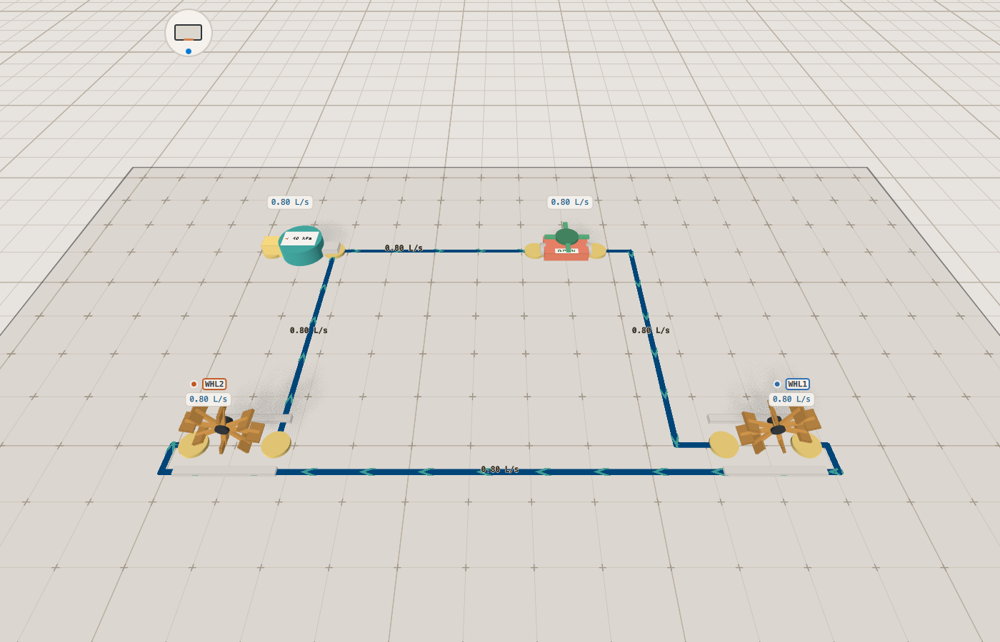
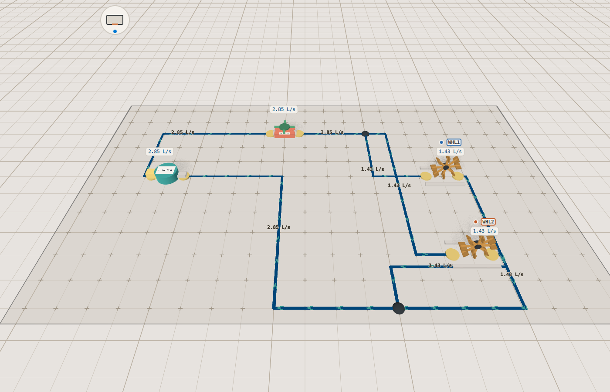

# Hydraulics 101 — the electricity lesson, told in water

*Companion paper to the interactive lab in `labs/hydraulics-101/`. Overview
board: `overview.grafli`. Kit model card: `labs/kits/hydro/README.md`.
Purpose: **teaching** — this is a lesson plan, the guided flow
(`wheel-basics`) is the primary artifact, and this paper is its script.
Started 2026-09-02. Annotate freely with CriticMarkup.*

## The question

A pump, a valve, a narrow pipe and a water wheel, plumbed into one loop.
Open the valve and the wheel turns. **How fast — and what decides it?**

The lab exists to make one idea concrete: a pump does not "make flow", it
holds a *pressure difference*, and everything in the loop pushes back
against it. The flow is what is left after the division. It is Ohm's law,
and a learner who has met it once in copper meets it again in water, where
the pushing and the resisting are things you can picture.

## The misconception it targets

*"The pump decides how much water flows. A bigger pump, more water; the
pipe just carries it."*

Arriving with that belief, a learner expects the wheel to turn at the same
speed whatever is in the loop, and expects a second wheel to get its own
share of "the pump's water" without the first one slowing down. Both are
wrong, and the lab is built so that the number says so.

## The demonstration sequence

| Beat | Scenario / action | Ask them | Flow step |
|---|---|---|---|
| 1 | empty board | what is the smallest circuit that does work? | `empty` |
| 2 | a pump appears; its card says 40 kPa | what does the number mean — water, or push? | `pump` |
| 3 | a water wheel | what is it for? | `wheel` |
| 4 | a narrow pipe, 8 kPa·s/L | why would anyone put this in? | `pipe` |
| 5 | plumbed into a loop with a shut valve | nothing moves — why not? | `plumb` |
| 6 | *they* open the valve | (they act) | `open` |
| 7 | the wheel turns; the plot shows 1.18 L/s | is it the same everywhere in the loop? | `turning` |
| 8 | the pump's head divided by everything in the loop | where does 1.18 come from? | `why` |
| 9 | `V` prints every reading | add the pressure drops round the loop | `values` |
| 10 | *they* narrow the pipe on its card | what happens to the wheel, and to the pipe's own reading? | `try` |

Then, outside the flow, the two presets the measured table is about:
`series` (the same water through two wheels) and `parallel` (two wheels on
one T-piece).

## The moment the number contradicts the belief

Beat 7, and then the presets. One wheel turns on **1.18 L/s**. Add a second
wheel *in series* and the flow drops to **0.80 L/s** for both of them — the
pump did not "have" 1.18 L/s to give; it had 40 kPa, and the second wheel
took its share of that. Put the second wheel *in parallel* instead and the
pump delivers **2.85 L/s**, each wheel gets 1.43 — more than one wheel alone
got — and the pump's terminal pressure sags from 37.6 to **34.3 kPa**. The
pump is being asked for more, and it keeps more for itself.

## The takeaway

*A pump holds a pressure; the loop decides the flow.*

## When they ask…

- **Why does the wheel in series get exactly half the pressure?** Because
  the two wheels are identical resistances in a row, and the drop across
  each is `R·Q` with the same `Q` — 19.2 kPa each, 38.4 kPa together, which
  is the pump's terminal pressure. The pump keeps the last 1.6 kPa
  (`records/series-42.labrec`, `pTerm`).
- **Why is parallel not simply twice one wheel?** It nearly is — 2 × 1.18
  would be 2.35 L/s and the pump delivers 2.85 — but each branch now sees
  no narrow pipe (the `parallel` preset has none), so each wheel gets more
  than the single loop's wheel did. What stops it being *more* than that is
  the pump's own loss: 5.7 kPa stay inside it at 2.85 L/s
  (`records/parallel-42.labrec`).
- **Is this really the same as the circuit lab?** Yes, term for term: kPa
  for volts, L/s for amps, kPa·s/L for ohms, and `kPa · L/s = W` with no
  factor. Set the pump's 40 kPa behind 2 kPa·s/L against the cell's 4.5 V
  behind 0.5 Ω and the two boards give the same shapes of number.

## Measured results

*Quote only what a record holds.* Every number below comes out of a
committed run record; regenerate them all with

```sh
labs/hydraulics-101/records/make.sh
```

and prove them stable with `records/make.sh --verify` (two runs, byte
compared). The valve is opened in every run — a record of a loop nothing
flows through would cite zeros.

| Scenario | pump flow `qPump` | terminal pressure `pTerm` | power into the parts | per wheel | Record |
|---|---|---|---|---|---|
| `wheel-basic` | 1.176 L/s | 37.65 kPa | 44.27 W | 1.176 L/s | `records/wheel-basic-42.labrec` |
| `series` | 0.800 L/s | 38.40 kPa | 30.71 W | 0.800 L/s each | `records/series-42.labrec` |
| `parallel` | 2.853 L/s | 34.29 kPa | 97.84 W | 1.427 L/s each | `records/parallel-42.labrec` |
| `metering` | 1.536 L/s | 36.93 kPa | 56.72 W | 1.536 L/s | `records/metering-42.labrec` |

Every recorded standard deviation is exactly 0: the solver reports an
operating point, not a history, so the 101 samples of each record are 101
copies of one answer — which is the check that this model has no hidden
time in it. The flow's `turning` step carries the same measured value as an
`expect` (1.1758 L/s within 5·10⁻⁴), so a drifted model breaks its own
lesson before it teaches a wrong number.

Two figures, regenerated by `figures/make.sh`, illustrate the pair the
table is about; nothing above is read off them.

| | |
|---|---|
|  |  |
| `series` — one flow on every run, 0.80 L/s | `parallel` — 2.85 L/s splits into 1.43 and 1.43 at the T-piece |

## Stated simplifications

Labs teach concepts, and a simplified model is a feature provided every
simplification is declared. The kit's model card
(`labs/kits/hydro/README.md`) argues each in full; the ones a learner will
trip over in this lab:

| Simplification | Why it is acceptable | What it costs |
|---|---|---|
| linear resistance, `Δp = R·Q` | it is the laminar regime, exactly where the electrical analogy holds | real pipe flow goes turbulent and `Δp` grows with `Q²`; the numbers here are the low-flow limit |
| no inertia, no compressibility | the lesson is about the steady state | no water hammer when the valve slams, no surge, no filling time |
| the pump is one number behind one resistance | a straight line through a real pump's head-flow curve | `Q_RATED = 3 L/s` is a convention, not a property the model derives |
| the wheel is a fixed resistance | its job is to be the load | no torque balance, no run-up; `speed` is a display scale |
| ideal connections | all resistance lives in parts | a long pipe run costs nothing, which no plumber believes |

## How to run it

```sh
./build/bin/claydojo --sbx labs/hydraulics-101/Sandbox.qml
```

Press `T` for the guided tour — that is the lesson.

**Key map — every key the lab handles.** Kept in sync with the header
comment in `Sandbox.qml`, the hint bar and the board.

| Key | Does |
|---|---|
| `1`–`4` | presets: one wheel · series · parallel · metering |
| `T` | guided tour · `Space`/`→` next · `←` back · `Esc` leave |
| `C` / `E` / `Del` | clear the board · eraser · remove the selection |
| `V` | cycle the printed value: flow → pressure → power → off |
| `Q` | plot the selected part |
| `R` / `#` | turn the selected part · grid mode (`Alt` inverts it for one drag) |
| `f` / `⇧F` / `0` | jump to a part by letter · frame the selection · reset the view |
| `H` / `P` | take the next instrument · keep its reading |
| arrows · `WASD` | travel · `Shift`+arrows turn · `+`/`-` zoom · `Space` held pans on the left button |
| `Shift+R` | record a run |
| `Ctrl +/-/0` | text size |
| `?` | every key |

The left mouse button is always the board's: an empty hand runs a pipe
between two flanges, tees off an existing run, selects and drags a part,
and operates the *selected* valve's handwheel on a second click. The right
button turns the view, the wheel zooms, a right click puts things down.

## Source map

- `labs/hydraulics-101/Sandbox.qml:1` — the lab; the domain bridge is the
  block headed *the water*, the lesson the `Flow` near the end
- `labs/hydraulics-101/strings.js:1` — every user-visible string, EN + DE
- `labs/kits/hydro/hydro.js:1` — the solver: nets by union-find, one stamp,
  one Gaussian elimination, flows peeled per run by continuity
- `labs/kits/hydro/parts.js:1` — what each part is to the board
- `plugins/clay_lab/Board.qml:1` — the board layer this lab is the second
  consumer of

*Line numbers drift with every edit — re-check them as the last step
before handover.*
