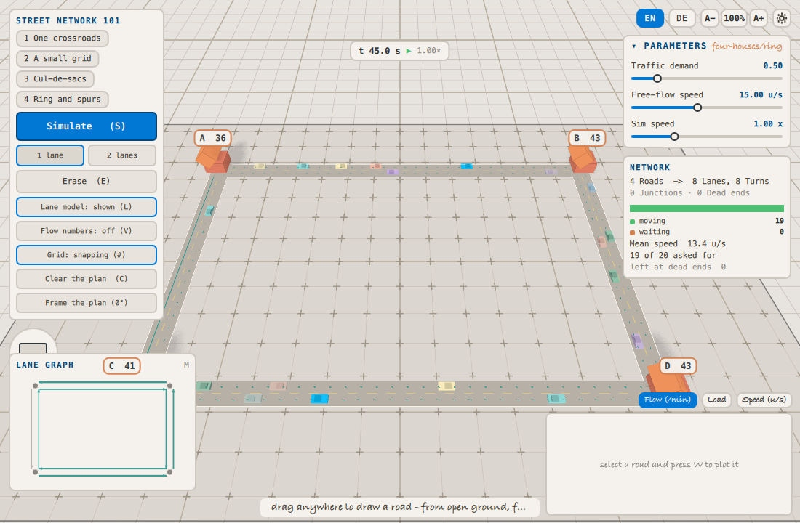
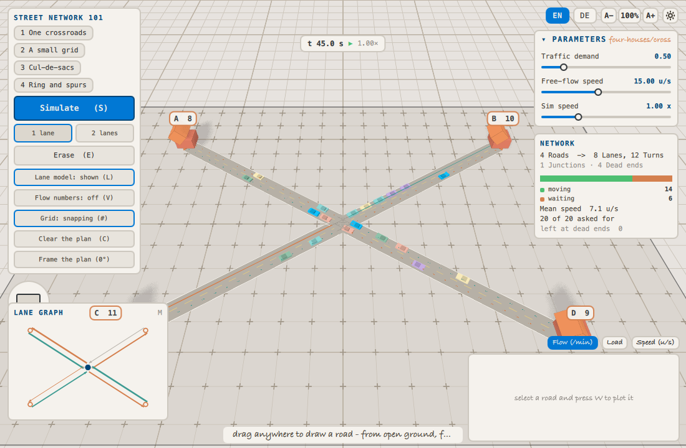

# Four houses, four networks — which shape carries traffic most steadily?

*A study against `labs/street-network-101`. Kit model card:
`labs/kits/traffic/README.md`.*

## The question

Four houses stand at fixed corners of a plot — A `(-70,-45)`, B `(70,-45)`,
C `(-70,45)`, D `(70,45)`. They generate a constant demand for travel between
them. We may connect them with any road network we like.

**Which of four candidate networks delivers traffic between the houses most
steadily, at fixed demand?**

Steadily, not merely *much*: a network that alternates between a rush and a
standstill is worse to live on than one that moves the same total traffic
evenly, and the difference is invisible in an average. So the objective is
the variability of the arrival rate over a run — lower is better — with the
**mean arrival rate** quoted beside it, because a network that delivers
nothing at all delivers it very steadily indeed, and the pair of numbers is
what stops that from looking like a win.

**Variability, measured relative to the rate.** The objective is
`stddev(arrivals) / mean(arrivals)` — a coefficient of variation — and not
the raw standard deviation. This study was first run with the raw spread and
the ranking it produced was mostly an artefact: the four networks turn out to
have arrival rates differing by a factor of four (see the results), and an
absolute spread grows with the level it is a spread of, so the slowest
network won for being slow. Dividing by the mean asks the question that was
actually intended — *how uneven is the delivery, relative to how much there
is* — and it is the one form comparable across four networks of different
geometry.

The four candidates, each joining the same four houses:

| id | shape | why it is a candidate |
|---|---|---|
| `cross` | four spurs to one central junction | shortest total road; everything meets in one place |
| `ring` | a loop around the perimeter | no junctions at all — the houses are bends |
| `grid` | the ring plus both mid-axes | many routes, many junctions |
| `tree` | two bars joined by a spine (an H) | acyclic: one route between any two houses |

## Answerability

Before running anything: every quantity the question needs, mapped onto a
parameter, a probe, or a model-card claim. Anything left unmapped forces a
reduced question, stated here rather than discovered in the results.

| the question needs | maps to | how it is checked |
|---|---|---|
| four fixed places traffic comes from and goes to | the lab's `houses`, set by the study's `setup` | `labInfo().network.houses` reports `declared` and `bound`; all four must bind |
| "the same demand" for every candidate | `demand` = 0.5, **plus** the houses pinning the fleet to `demand × 10 × 4 = 20` cars | `fixed.demand`, checked against `labInfo().params` by `lab-sweep --check` |
| "the same driving" for every candidate | `speed` = 15 u/s, everything else at kit defaults | `fixed.speed`, likewise |
| a network's shape as the thing being varied | four `eval` levels building the plan through the roadgraph API | each level's roads are in the manifest below |
| traffic *delivered between the houses* | the `arrivals` probe — smoothed arrivals per minute across all houses | `labInfo().probes`, likewise |
| *steadiness* of that delivery, comparably across networks | `stddev(arrivals) / mean(arrivals)` over the recorded run | read out of each run record's probe summary |
| how much is delivered at all | `mean(arrivals)` | likewise |
| whether a network is congested while it delivers | `mean(waiting)`, `mean(meanSpeed)` | likewise |
| that every network really carried the same fleet | `mean(cars)` — must sit at the pinned target of 20 | likewise |
| that a difference is not noise | four seeds per candidate; the seed spread is reported next to it | `seeds` in the manifest |
| the model to hold for "traffic between fixed points" | **model card**, *Houses*: journeys start and end at houses, and `target` pins the fleet so a longer network does not silently get more cars | argued below |

**Where it is honest, and where it is reduced.** Three things this lab cannot
hold, and the question is cut to fit them rather than around them:

1. **No routing.** A car leaving A is not trying to reach B; it walks the
   network at random and is absorbed by whichever house it meets first. So
   `arrivals` measures *how well the network delivers traffic between fixed
   points*, never *how well anyone gets where they were going*. The question
   is asked in exactly those terms, and "which network gives the shortest
   A→D trip" is **not answerable here**.
2. **No per-house time series.** `arrivedAt` gives a final count per house,
   but it is not a recorded probe, so this study can quote the final split
   and say nothing about how it developed. **Reduced:** the question is about
   aggregate steadiness, not about whether the four houses are served
   *equally* steadily. Answering the fairness question would need a probe per
   house; it was not added, because four more probe columns in every record
   is a real cost for a question nobody asked.
3. **The arrival rate is already smoothed** — the kit's 12 s exponential
   window, the same one behind the per-road flow numbers. Its standard
   deviation is therefore variability *at the scale a person watching the
   plan would notice*, not tick-to-tick counting noise. That is the intended
   reading, but it is a choice, and a different window would give different
   numbers.

One thing deliberately **not** treated as a confound: the four networks have
different total lane lengths, so 20 cars is a different density on each. That
is not a flaw in the comparison — it is part of what choosing a network
means. What would have been a flaw is letting the *fleet* grow with the road,
which is exactly what `demand` does without houses, and why this study pins
`target` through them.

## Method

Each run: build the plan, place the houses, reset the clock, advance 30
simulated seconds unrecorded so the fleet reaches its working size, then
record 60 simulated seconds at 1/60 s steps, sampled every 0.25 s (the lab's
`SimClock.sampleInterval`) — 240 samples per record.

The warm-up is not cosmetic. From cold, `arrivals` climbs from zero as the
first cars complete their first journeys; recording that ramp would put the
same rising edge into every record and inflate every candidate's standard
deviation by the same transient, which is the fastest way to make four
different networks look alike.

Runs are driven by `tools/lab-sweep`, which stops the frame ticker and
advances the clock by hand — a frame is a wall-clock interval, so a lab left
to play itself is not reproducible. Steps in, sim seconds out, same bytes
every time.

```json
{
  "manifest": "clay-lab-study/1",
  "study": "topology-four-houses",
  "lab": "labs/street-network-101/Sandbox.qml",

  "objective": {
    "probe": "arrivals",
    "statistic": "stddev",
    "normalize": "mean",
    "direction": "minimize"
  },

  "report": [
    { "probe": "arrivals", "statistic": "mean" },
    { "probe": "arrivals", "statistic": "stddev" },
    { "probe": "waiting", "statistic": "mean" },
    { "probe": "meanSpeed", "statistic": "mean" },
    { "probe": "cars", "statistic": "mean" }
  ],

  "record": { "probes": ["arrivals", "waiting", "meanSpeed", "cars"] },

  "run": { "warmupSteps": 1800, "steps": 3600, "stepHz": 60, "budget": 16 },

  "fixed": { "demand": 0.5, "speed": 15 },

  "setup": [
    "clearPlan()",
    "setHouses([[-70,-45],[70,-45],[-70,45],[70,45]])"
  ],

  "parameters": [
    {
      "name": "topology",
      "kind": "eval",
      "levels": [
        {
          "id": "cross",
          "eval": [
            "addRoad(-70,-45, 0,0)",
            "addRoad(70,-45, 0,0)",
            "addRoad(-70,45, 0,0)",
            "addRoad(70,45, 0,0)"
          ]
        },
        {
          "id": "ring",
          "eval": [
            "addRoad(-70,-45, 70,-45)",
            "addRoad(70,-45, 70,45)",
            "addRoad(70,45, -70,45)",
            "addRoad(-70,45, -70,-45)"
          ]
        },
        {
          "id": "grid",
          "eval": [
            "addRoad(-70,-45, 70,-45)",
            "addRoad(70,-45, 70,45)",
            "addRoad(70,45, -70,45)",
            "addRoad(-70,45, -70,-45)",
            "addRoad(0,-45, 0,45)",
            "addRoad(-70,0, 70,0)"
          ]
        },
        {
          "id": "tree",
          "eval": [
            "addRoad(-70,-45, 70,-45)",
            "addRoad(-70,45, 70,45)",
            "addRoad(0,-45, 0,45)"
          ]
        }
      ]
    }
  ],

  "seeds": [11, 23, 42, 57]
}
```

Sixteen runs, and `run.budget` is 16: the cap is a hard one, so widening the
matrix has to be a deliberate edit rather than something that happens.

Check it against the lab before running it — this proves every probe and
parameter named above exists, which is the mechanical half of the
answerability table:

```
tools/lab-sweep/lab-sweep labs/street-network-101/studies/topology-four-houses --check
```

<!-- results:begin — everything below is the answer.
     For a student edition, cut from here down and withhold records/ and
     results.md; everything above states the question, the validity argument
     and the method, which is exactly the assignment. -->

## Results

Run with:

```
tools/lab-sweep/lab-sweep labs/street-network-101/studies/topology-four-houses
```

Full tables in `results.md`; the 16 records they were read from are in
`records/`. Every number below is quoted from a record id, and nothing in
this section was typed from memory.

### The ranking

| rank | network | `stddev/mean` of arrivals | spread over seeds | mean arrivals /min | mean waiting % | mean speed u/s |
|---|---|---|---|---|---|---|
| 1 | `ring` | **0.045** | 0.019 | 222.6 | 0.0 | 13.50 |
| 2 | `cross` | 0.099 | 0.061 | 53.4 | 29.9 | 6.21 |
| 3 | `tree` | 0.101 | 0.025 | 64.5 | 13.5 | 8.90 |
| 4 | `grid` | 0.111 | 0.101 | 87.9 | 10.7 | 10.68 |

The fleet check first, because the whole comparison rests on it: the
per-network mean of the `cars` probe runs from 19.16 (`ring`) to 19.88
(`cross`) against a pinned target of 20, and no single run leaves the band
19.06 (`ring-57`) – 19.90 (`cross-11`). Every network really did carry the
same traffic, so nothing below is a lane-length effect in disguise.

**The ring wins, and it wins cleanly.** Its worst run (`ring-11`, 0.056) is
steadier than the best run of every other network (`grid-42` 0.070,
`cross-11` 0.072, `tree-57` 0.085). Not one of the twelve non-ring runs
overlaps any of the four ring runs, which is a stronger statement than the
means alone — with four seeds each, a gap that no realisation crosses is
worth more than a difference between averages.

**The other three are indistinguishable.** `cross` 0.099, `tree` 0.101,
`grid` 0.111 sit inside their own seed spreads (0.061, 0.025, 0.101). Four
seeds cannot separate them and this study does not claim to. Their *order* in
the table is not a result.

### Why the ring wins

The reason is structural, and the lab reports it without any traffic having
to run — from `labInfo().network`:

| network | roads | junctions | dead ends | turns | **conflict pairs** | lane length |
|---|---|---|---|---|---|---|
| `cross` | 4 | 1 | 4 | 12 | 30 | 635 |
| `ring` | 4 | 0 | 0 | 8 | **0** | 864 |
| `grid` | 12 | 5 | 0 | 44 | 54 | 1212 |
| `tree` | 5 | 2 | 4 | 12 | 12 | 698 |

A ring through four houses **has no junctions at all**. Every one of its
nodes is a house, and a house absorbs — so no car ever turns a corner, no two
streams ever cross, and there is nothing to yield to. Zero conflict pairs is
not a figure of speech here: `mean(waiting)` is exactly `0.000` in all four
ring records, and mean speed sits at 13.5 of the 15 u/s free-flow limit.
Nothing on that network ever stops, so the only variation left in its arrival
rate is the randomness of where cars are placed.

That also explains the fourfold arrival rate (222/min against 53–88), and it
is **not** a fourth-place-to-first-place quality difference: on the ring a
journey is at most one road long, on the cross it is at least two. Shorter
journeys complete more often. This is exactly the confound that made the raw
standard deviation useless as an objective, and it is why the ranking above
is a coefficient of variation.

The congested end of the table is the mirror image. The `cross` funnels all
four houses through one junction with 30 conflict pairs; 29.9% of its cars
are standing still at any moment and mean speed is 6.2 u/s, under half of
free flow.

The two figures show it without a number in sight — same seed, same 45
simulated seconds, the arrival count on each house's chip:

| | |
|---|---|
|  |  |
| `ring` — 36 / 43 / 41 / 43 arrivals, no queue anywhere | `cross` — 8 / 10 / 11 / 9 arrivals, a queue on every approach |

Regenerate both with `figures/make.sh`, which steps the clock the same way
the sweep does, so the two pictures are the same instant of the same seed.
The figures are illustrative only: nothing in the ranking is read off them,
every number comes from `records/`.

## Conclusion

**Among these four networks, the ring is the steadiest way to connect four
fixed houses at fixed demand** — a coefficient of variation of 0.045 against
0.099 for the next best, a factor of 2.2, with no overlap between the ring's
runs and anything else's. It is also the fastest and the least congested, so
this is not a case of buying steadiness with throughput.

The mechanism is worth more than the ranking: the ring wins **because it has
no junctions**. Connect four points around their perimeter and every node is
a destination; nothing crosses anything. Every other shape here introduces at
least one place where two streams must take turns, and taking turns is what
makes flow uneven. The grid — the most road, the most routes, the most
junctions — is the *least* steady of the four.

Read that with its limits attached. It is a claim about **delivering traffic
between fixed points on this model**, where drivers have no destination and
choose turns uniformly. A ring is only conflict-free while every node on it
is a house; add one crossing road, or one more house between two others, and
the argument stops applying. And nothing here says a ring is a good street
network for a town — this model has no signals, no route choice and no
priority, so "no junctions" is a much larger advantage here than it would be
in a system where junctions are managed.

### Where to take it next

The obvious follow-ups, all within what this lab can hold: sweep `demand` to
find where the ring's advantage breaks down (it should, once the ring's own
lanes saturate); add a fifth house on the middle of one ring road and watch a
junction appear; ban one turn on the grid and see whether its variability
falls. Each is a new study beside this one, and each would need its own
answerability table before it ran.
